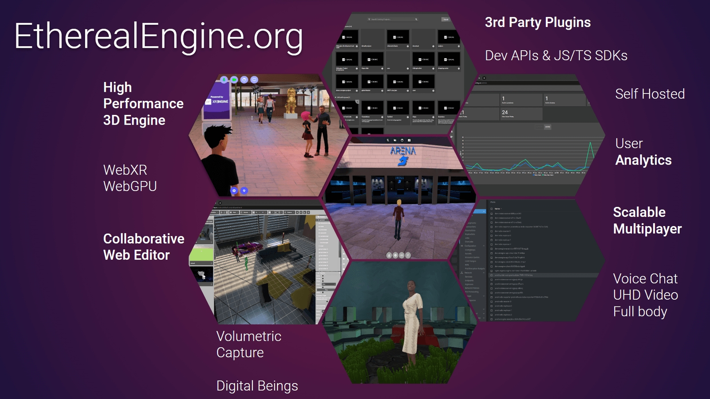
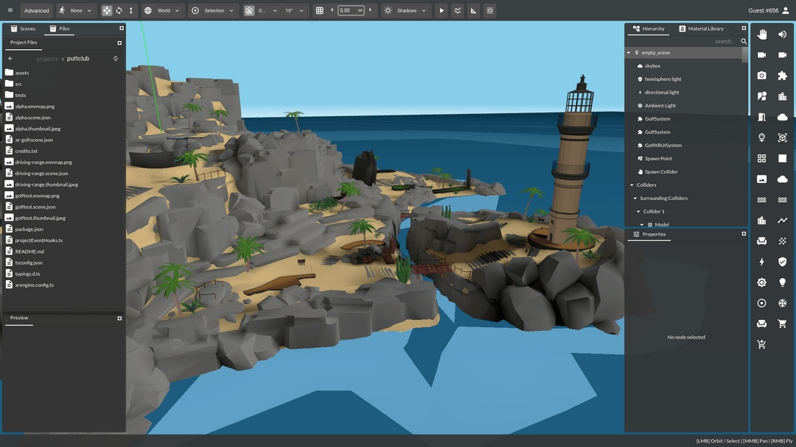
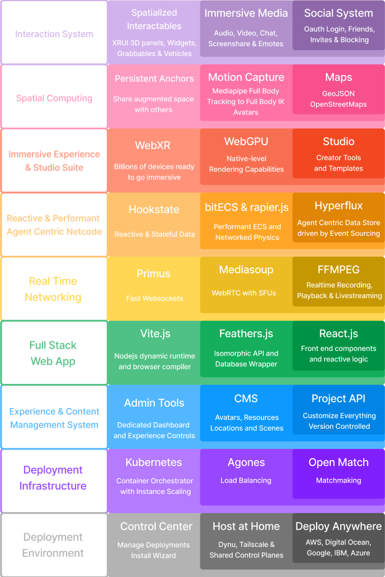

# Ethereal Engine

Ethereal Engine is a free, open, full-stack MMO engine that anyone can run for
any reason - to host events, make games, showcase art, or just to provide a space for your community. There are plenty of platforms on which you can spend a bit to have a world, but you can't be in complete control of the experience or customise it from the ground up.

When the Ethereal Engine stack is deployed, that stack is sovereign, open and cross
platform by default. Users can create any kind of game or experience with no limits.
With the tech that's being built now, users will be able to seamlessly travel
through portals from any worlds to any other world, on different servers, and have all
their data and identity travel with them.

This technology is for everyone, but especially people who want to build or
belong to a community.

## WebXR Engine
The core engine is the heart of Ethereal Engine. Based around the WebXR spec, brought to life with libraries such as [threejs](https://threejs.org/), [bitecs](https://github.com/NateTheGreatt/bitECS), [rapier.js](https://github.com/dimforge/rapier.js), [Mediasoup WebRTC](https://github.com/versatica/mediasoup), [reactjs](https://reactjs.org/) & [hookstatejs](https://hookstate.js.org/). With the latest understanding of Data-Oriented Design, ECS and Event-Sourcing paradigms, we have put together a robust MMO XR framework that rivals AAA capabilities, quality and speed.

## On The Web
Built for the web, Ethereal Engine providers a fully customisable and clean UI that works in both immersive and non-immersive contexts, as well as an administration panel for full control of deployment, locations, projects, avatars, custom routes & more.

## Deployment Stack
Running on the backend is a state of the art fullstack framework, template & deployment pipeline using [kubernetes](https://kubernetes.io/), [docker](https://www.docker.com/), [agones](https://agones.dev/site/), [openmatch](https://open-match.dev/site/) & [feathersjs](https://feathersjs.com/). The result is a fully customisable and scalable web app.

## Ethereal Studio
The Studio sits on top of the engine, as a heavily modified version of [Mozilla Hubs' Spoke editor](https://hubs.mozilla.com/spoke). It has been transformed with the engine and the web app to provide a fast and comprehensive Content Management System, file browser, cloud edge caching, content pipeline tools and other creator tools.

## Project API
The Project API is the core of what makes Ethereal Engine shine - the ability to load your own scenes, assets & code with a click of a button. Using github, we allow users to have fully version controlled access to extend the base functionality. You can see examples of the Project API in action [here](https://etherealengine.com/explore) and [here](https://github.com/EtherealEngine/ee-development-test-suite)

## Stack Overview

