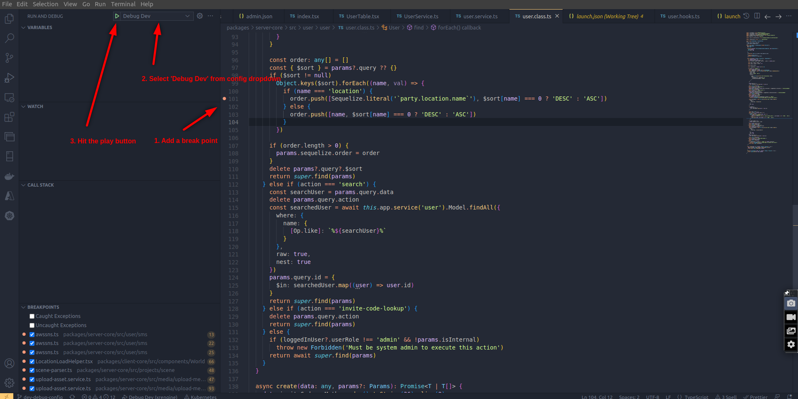

# Debugging
This section covers different techniques for debugging source code.

## Basic Debugging
This setup can be used to debug instance server & backend server code.  
1. Navigate to `Run & Debug` tab of vscode.
2. Add a breakpoint to the desired line of code.
3. Select `Debug Dev` from debug config dropdown.
4. Hit the run/play button to start debugging.
5. Breakpoint will be hit as the code executes that line of code.

The image below further elaborates this.

