import StepAuthentication from '../_partials/controlCenter/step_authentication.md'
import StepConfigurations from '../_partials/controlCenter/step_configurations.md'
import StepVariables from '../_partials/controlCenter/step_variables.md'
import StepSummary from '../_partials/controlCenter/step_summary.md'

# Control Center: Getting Started
Ethereal Engine's Control Center is a self-contained Metaverse world in a box. Take what you need or launch the full stack.  
The Control Center is a desktop app to manage an Ethereal Engine cluster.

We know it's been complicated to build with Ethereal Engine and we've made this tool to give the community easy access to the engine. We would love to see your creations and invite you all to come build with us.

## Overview
The Ethereal Engine Control Center app provides access to various functionalities which includes:
- Configure your Ethereal Engine in a cluster in just a few clicks.
- View status of Ethereal Engine dependencies on your local system.
- Manage an Ethereal Engine deployment through admin panel.
- Manage kubernetes cluster through its dashboard.
- Manage IPFS node running in the cluster.
- Execute commands against rippled server.
- See realtime logs of different actions being performed.

## 1. Downloading Control Center App
In order to download Ethereal Engine Control Center App, navigate to [releases](https://github.com/EtherealEngine/etherealengine-control-center/releases) page and download the latest version of the App.
- **Windows** _(and WSL)_: Download the `.exe` file

  > You will need to allow permission for executing ps1 scripts.  
  > You can do so by running following command in Powershell with admin privileges ([reference](https://github.com/EtherealEngine/etherealengine-control-center#2-windows-permission-to-run-ps1-scripts)).  
  > ```Powershell
  > Set-ExecutionPolicy -ExecutionPolicy Unrestricted
  >```

- **Linux**: Download the `AppImage` file
  > Once downloaded, right click and go to **Properties** of AppImage.  
  > In **Permissions** tab check 'Allow executing file as program'.  
  > Afterwards, double click on AppImage to launch the app.

  > Ubuntu 22.04 or later:  
  > If you are unable to launch the AppImage, you might have to install Fuse with the following command _([reference](https://github.com/EtherealEngine/etherealengine-control-center#1-app-not-launching-in-ubuntu-2204))_.
  > ```bash
  > sudo apt-get install fuse libfuse2
  >```

## 2. Launch & Create Cluster

You will see this screen when you launch the app for the first time:

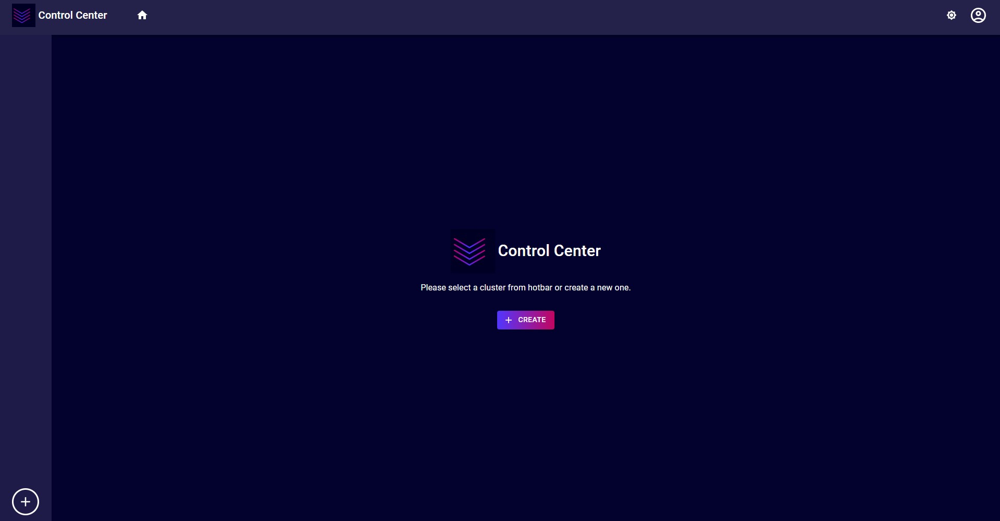

Here you will need to create a cluster.  
You can do so by:
- Clicking on the `Create` button in the center of your screen.
- Anytime using round plus button on left bottom corner (in [hotbar](#31-hotbar)) of the screen. 

### 2.1. Cluster Information
These are the different sections of the create cluster dialog.

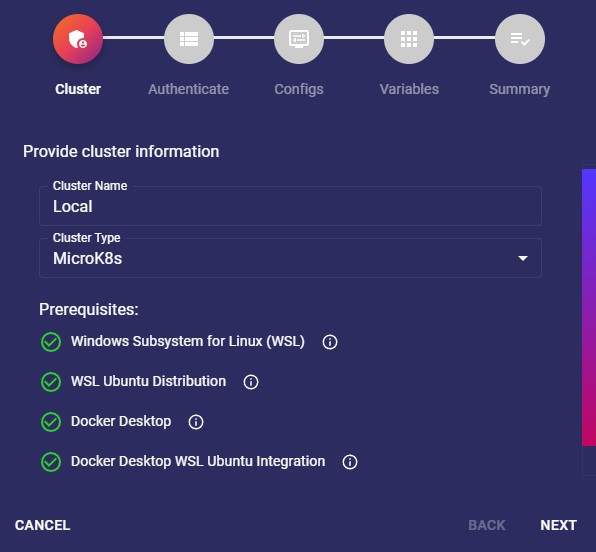

In this step, you will need to provide the following information:
- **Cluster Name:**  
  This can be any name you want to give your cluster.  
  _eg: `Local`, `my-metaverse`, etc._
- **Cluster Type:**  
  This will be the kubernetes distribution you want to use.  
  There are two local distributions at the time of this writing: MicroK8s(recommended) and Minikube.  
  There is also a Custom type which allows you to connect to an existing Ethereal Engine cluster.
  > Currently, `MicroK8s` is supported on Windows & Linux while `Minikube` is supported on Linux only.

- **Prerequisites:**  
  These are the set of items that should be manually configured by the user.  
  > If an item is correctly setup then its status will be green tick.  
  > Otherwise it will have a red cross with details and link to docs for the corrective measures.

  > Currently, there are prerequisites for MicroK8s in Windows only.

### 2.2. Cluster Type: MicroK8s or Minikube
You will see the options below if you selected your cluster type as MicroK8s or Minikube.

### 2.2.1. Authentication
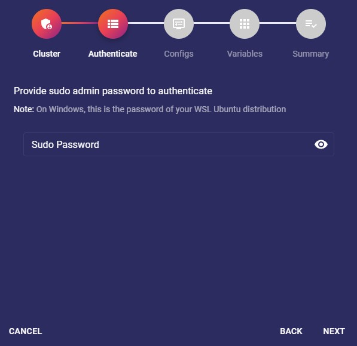

<StepAuthentication />

### 2.2.2. Configurations

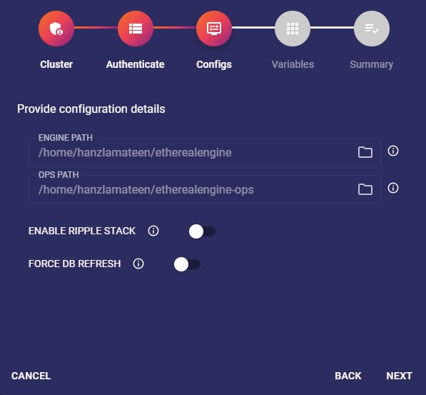

<StepConfigurations />

### 2.2.3. Variables


<StepVariables />

### 2.2.4. Summary

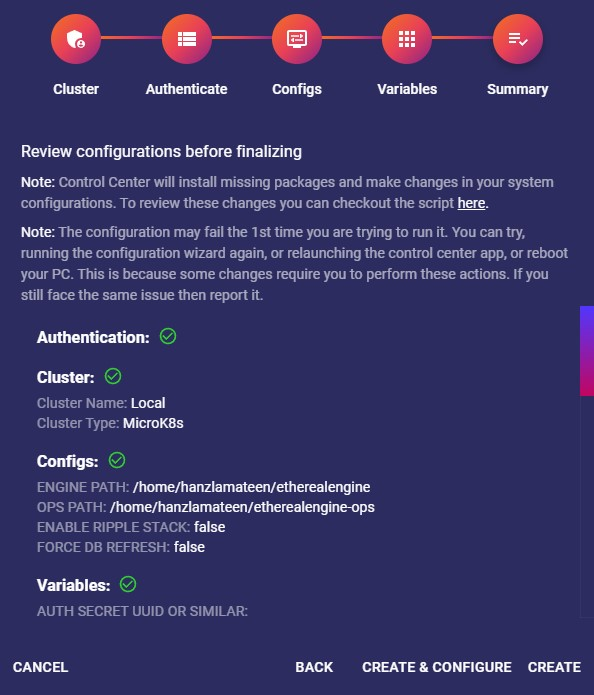

<StepSummary />

1. **Create:**  
   Will create the cluster entry and show the [cluster screen](#3-cluster-screen) of this cluster.  
   This is the best option to choose by default for most users.  

1. **Create & Configure:**  
   Will create the cluster entry and show the current status of things.  
   Afterwards, it will automatically start the configuration script to ensure everything is setup.  
   :::note
   You can still run the Configure script as discussed later in this [guide](#4-configure-cluster) if you choose the `Create` option.
   :::

### 2.3. Cluster Type: Custom
The Custom cluster type allows to connect to an existing kubernetes cluster.  
You will see the options below if you selected this type.  

### 2.3.1. Kubeconfig
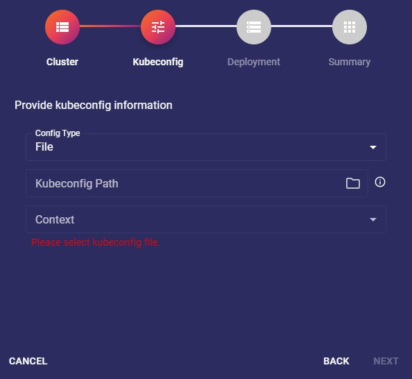

In this step, you will need to provide following information regarding desired cluster's kubeconfig:
- **Config Type: Default**  
  Loads the default kubeconfig file of your system.
- **Config Type: File**  
  Loads kubeconfig from a file of your system.
- **Config Type: Text**  
  Loads kubeconfig from a text.
- **Context**:  
  This is the selected kube context of the cluster in which your Ethereal Engine deployment exists.  
  The dropdown will show all contexts that exist for the selected config type.

### 2.3.2. Deployment
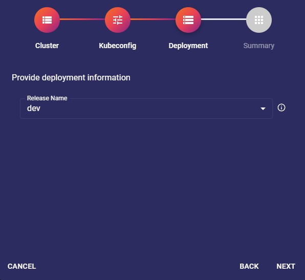

In this step you will need to provide the following deployment information:
- **Release Name**:  
  This is the name of your release in selected kubernetes deployment.  
  It can be `dev`, `prod`, `local`, etc, and will be used to prefix the workloads of your cluster.
  > `{RELEASE_NAME}-etherealengine-client`  
  > eg: `prod-etherealengine-client`

### 2.3.3. Summary
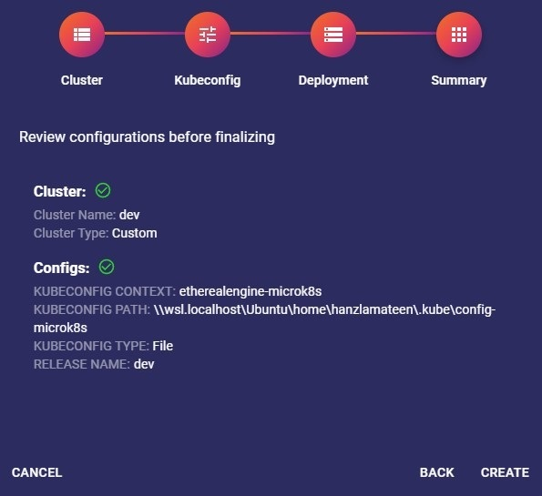

<StepSummary />

- **Create:**  
  Will create the cluster entry and show the [workloads screen](#6-workloads) of this cluster.

## 3. Cluster Screen
You will be sent to this screen once you have created a cluster.
> _Also know as the `config` page_.

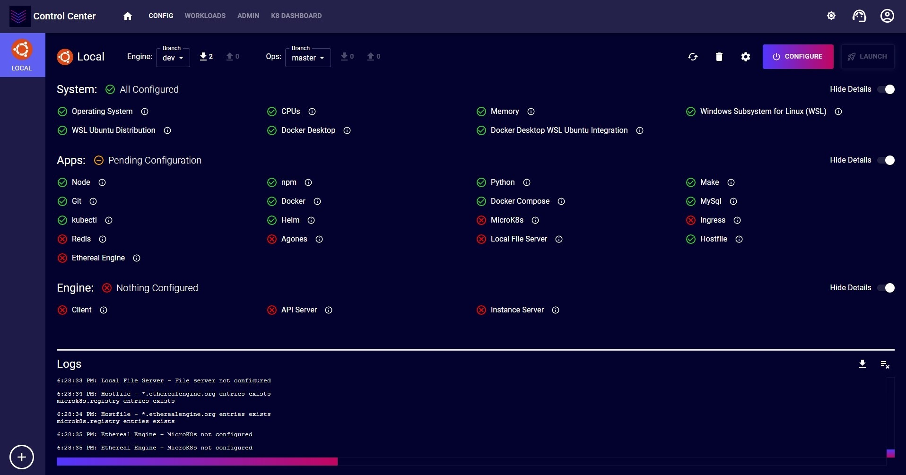

Lets explain various sections of this screen.

### 3.1. Hotbar
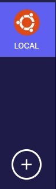

Shows a list of all the clusters you have created.  
You can click on each of them to view the cluster screen of them.

 The plus icon at the bottom of this bar is used to create a new cluster.

### 3.2. Navbar


The Navbar allows navigation and various utility options.
- **App Icon**:   
  The logo of this application.

- **Home Icon**:   
  Navigate to home.

- **Config**:  
  Navigates to the [cluster](#3-cluster-screen) screen of selected cluster.

- **Workloads**:  
  Navigates to [workloads](#6-workloads) screen of selected cluster.

- **Admin**:  
  Navigates to ethereal engine [admin](#7-admin-dashboard) panel of selected cluster.

- **K8 Dashboard**:  
  Navigates to kubernetes [web dashboard](#8-k8-dashboard) of selected kubernetes distribution.

- **IPFS**:  
  Navigates to IPFS [web UI](#9-ipfs) of selected cluster. This option is visible only if ripple stack is enabled.

- **Rippled CLI**:  
  Navigates to rippled [server cli](#10-rippled-cli) of selected cluster.  
  Visible only when ripple stack is enabled.

- **Change Theme Icon**:   
  Allows to toggle between vaporware, light & dark themes. The color scheme of these themes are similar to ethereal engine.

- **Support Icon**:   
  Opens a dropdown menu to allow reaching out to support via Discord or Github.

- **User Icon**:   
  The functionality for this button is coming soon.

### 3.3. Options Panel


This section shows various actions that can be activated on the currently selected cluster:
- **Cluster Icon**:   
  Logo of the selected cluster type.  
  It can be MicroK8s or Minikube logo.

- **Cluster Name**:  
  Name that you entered in create cluster dialog. _eg: `Local`_

- **Engine Git Status**:   
  View and change the state of your local Ethereal Engine GitHub repo.  
  View current branch, pull incoming changes and push outgoing changes.  

- **Ops Git Status**:   
  View the current status of your local Ethereal Engine ops GitHub repo.  
  You can perform the same actions explained in the previous bullet point _(Engine Git Status)_.

- **Refresh Icon**:   
  Will recheck the status of prerequisites, system, apps & engine.  
  It also rechecks the status of the engine and ops git repositories.  
  It will be disabled, until its finished, when a refresh is already in process.

- **Delete Icon**:   
  Deletes a cluster.  
  It will not make any changes in the associated local kubernetes, app, etc.

- **Settings Icon**:   
  Will open the settings dialog.  
  This dialog contains specific settings for the selected cluster, in addition to other general app settings.

- **Configure Button**:   
  Will open the configure dialog which will be [discussed](#4-configure-cluster) later.  
  It will be disabled and have a spinner in it when a configuration is already running.

- **Launch Button**:   
  This button will open Ethereal Engine's default location in your browser as [discussed](#5-launch-ethereal-engine) later.

### 3.4. System Status
This section will show whether or not the system requirements are currently met.  
> On Windows: It will also show the status of the prerequisites.

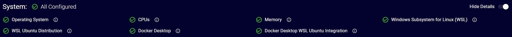

The status will be displayed right next to each item.  

You can find more details by hovering over the  info icon.  
Very useful when one of the items is not configured correctly.

Some items might have an  auto fix icon attached.  
Clicking this button will try to auto fix the problem.  
If it fails: Use the configure dialog [discussed](#4-configure-cluster) later.

:::important
The Autofix button should only be used if you were able to run the cluster successfully before.  
Otherwise you will need to use the configure dialog.
:::

### 3.5. Apps Status
This section shows the current status of all the apps required to run an Ethereal Engine deployment.
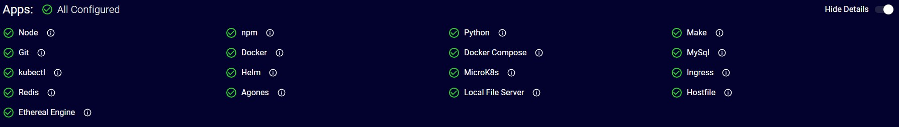

### 3.6. Engine Status
This section shows the current status of various components of an Ethereal Engine deployment in your local kubernetes distribution.
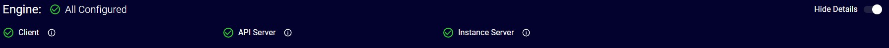

### 3.7. Logs
This section shows all logs for the current session.  
There are logs for most actions performed by the Control Center and their outputs.


- **Download Button**:   
  Will download all displayed logs.
- **Clear Button**:   
  Will clear all displayed logs.

## 4. Configure Cluster
You will need to run the configure script to automatically fix any of the status entries of the [cluster screen](#3-cluster-screen).  
You can do so with the  button in the [options panel](#33-options-panel)  
Following are the different sections of configure cluster dialog:

:::important[recommended]
Always clear your logs before running the configure script to trace its output easier.
:::

### 4.1. Authentication

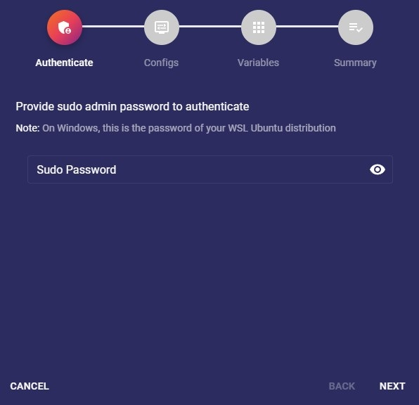

<StepAuthentication />

### 4.2. Configurations

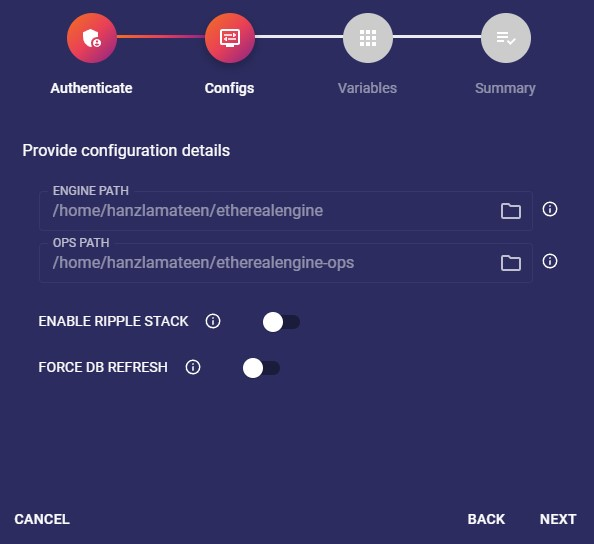

<StepConfigurations />

### 4.3. Variables

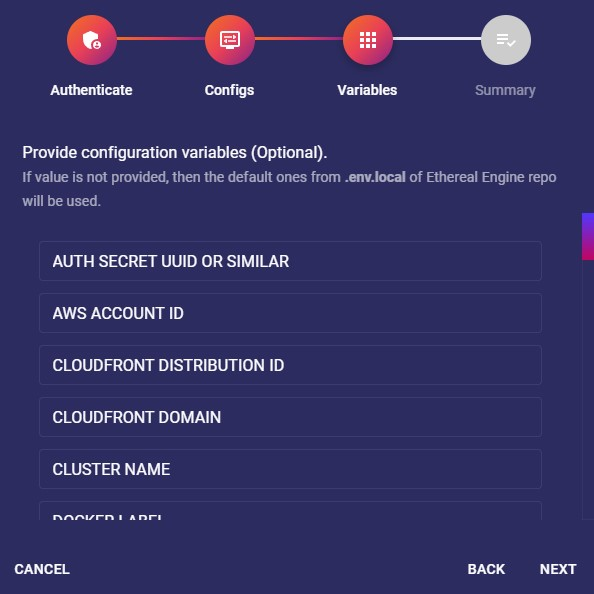

<StepVariables />

### 4.4. Summary

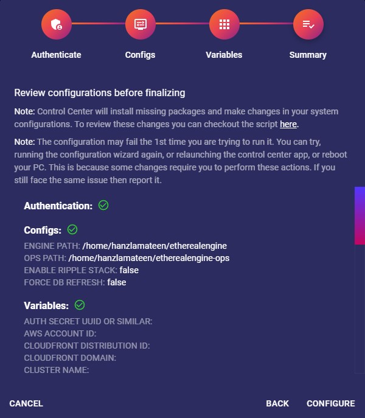

<StepSummary />

- **Configure:**  
  This will start the configuration script which will ensure that things are correctly setup.  
  You can track the output of each step of the process with its [logs](#37-logs).  
  It can take a while to setup things depending on your system and the status of your applications.  
  The  button will be disabled and have a spinner in it when a configuration process is already running.
  :::note
  The cluster status will be automatically refreshed once the script finished its execution.
  :::
  :::important
  If the configure script failed:  
  Pay close attention to last few lines of the [logs](#37-logs). They will contain the reason why the script failed.
  :::

## 5. Launch Ethereal Engine
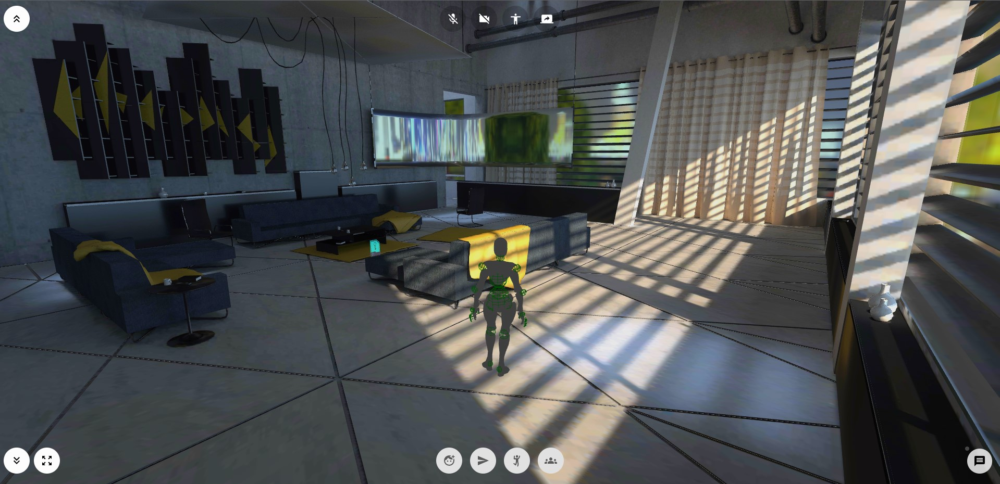

If everything was configured correctly and all ticks are green on the "config" page _(aka [Cluster Screen](#3-cluster-screen))_,  
you will now be able to `Launch` the engine from the [options panel](#33-options-panel).  
This button will open Ethereal Engine's default location in your browser.

:::important
Make sure to allow certificates as explained [here](https://etherealengine.github.io/etherealengine-docs/docs/devops_deployment/microk8s_linux#accept-invalid-certs).
:::

## 6. Workloads
Workloads are the k8s pods of the components of an Ethereal Engine deployment.  

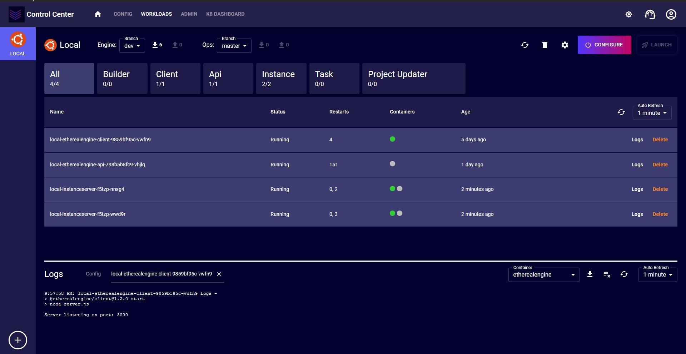

### 6.1. Workload Tabs
The Workload Tabs section allows you to filter workloads based on their types.   
The default tab will be `All`, which displays all workloads.  
The number below each tab's label displays: `currently ready count`/`total count`.
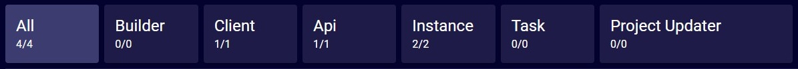

### 6.2. Workloads Table
This section displays data based on selected workload [tab](#61-workload-tabs).
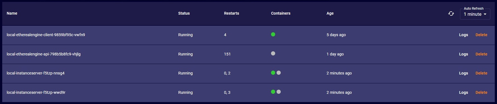

For each workload, it contains pod name and other details. Hovering over a container's circle will display further details. Moreover, there is a `Logs` button to view kubernetes container logs as discussed in next [section](#63-workload-logs). `Delete` button will allow to remove the pod from current kubernetes distribution.

Additionally, there is refresh icon button on right top of this table. This will refresh/reload data being displayed. There is also an auto refresh drop down next to it, which will automatically perform refresh after selected interval.

### 6.3. Workload Logs

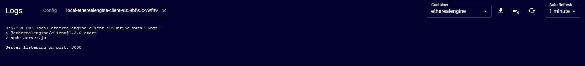

This section will by default display cluster [logs](#37-logs). Though if user clicked `Logs` button as discussed in previous [section](#62-workloads-table), then the logs of that workload will be displayed. The cluster [logs](#37-logs) will then be displayed under `Config` log tab. User can toggle between these log tabs, while workload logs can be closed as well.

The download and clear icon button will perform actions based on selected log's tab. Additionally for workload logs, there is refresh icon button on right top of this section. This will refresh/reload logs being displayed. There is also an auto refresh drop down next to it, which will automatically perform refresh after selected interval.

Beside these icons there is also a container drop down through which user can select the workload's pod container for which logs are displayed.

## 7. Admin Dashboard

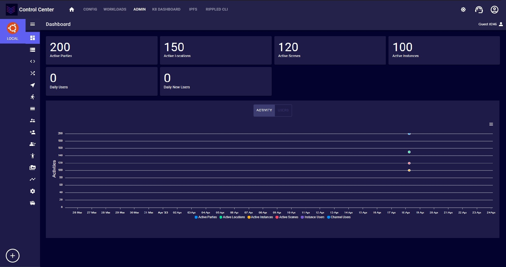

Once, everything is configured correctly and all ticks are green on config page ([Cluster Screen](#3-cluster-screen)) then you can click on `Admin` button in [navbar](#32-navbar). This will show the admin dashboard of ethereal engine deployed in your local k8s cluster.

You can perform various actions from admin dashboard including installing projects, managing users, groups, locations, instances, resources, etc.

## 8. K8 Dashboard

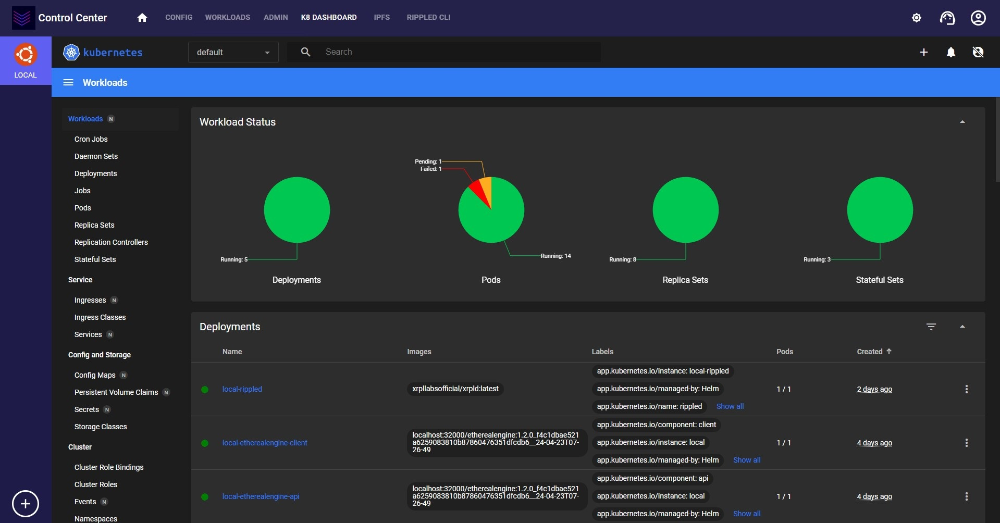

Once, your selected local k8s distribution (Microk8s or Minikube) has a green tick on config page ([Cluster Screen](#3-cluster-screen)) then you can click on `K8 Dashboard` button in [navbar](#32-navbar). This will show the k8s dashboard.

For MicroK8s, when you launch it for the first time then you will be asked regarding token configurations. You can use `Skip` button to pass through it.

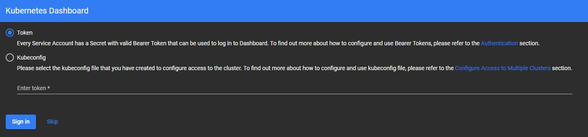

You can perform various actions from k8s dashboard including managing pods, jobs, deployments, services, etc.

## 9. IPFS

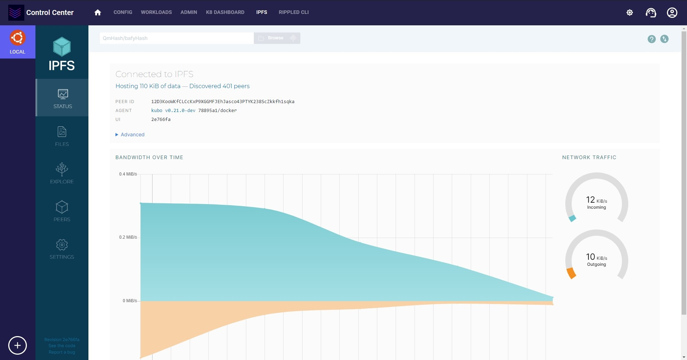

If ripple stack is enabled and once, IPFS has a green tick on config page ([Cluster Screen](#3-cluster-screen)) then you can click on `IPFS` button in [navbar](#32-navbar). This will show the IPFS web UI.

You can view and manage various aspects of the IPFS running in your local cluster using this dashboard. IPFS is not required by default for engine, though for custom use cases it can be used.

## 10. Rippled CLI

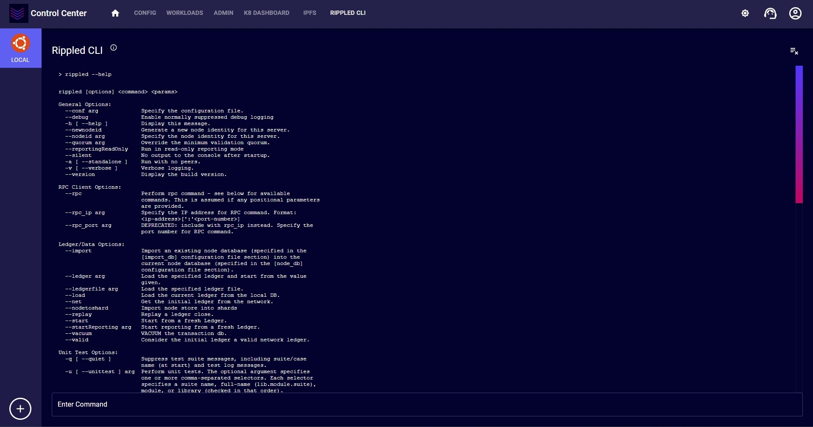

If ripple stack is enabled and once, Rippled has a green tick on config page ([Cluster Screen](#3-cluster-screen)) then you can click on `Rippled CLI` button in [navbar](#32-navbar). This will show the Rippled CLI page.

You can run various commands against `rippled` server and view their outputs. Rippled is not required by default for engine, though for custom use cases it can be used.

## 11. Updating the App

Every time you launch control center app it will check for the latest version of the app. If there is an update, then it will prompt to update. Its always recommend to use the latest version of the app.

