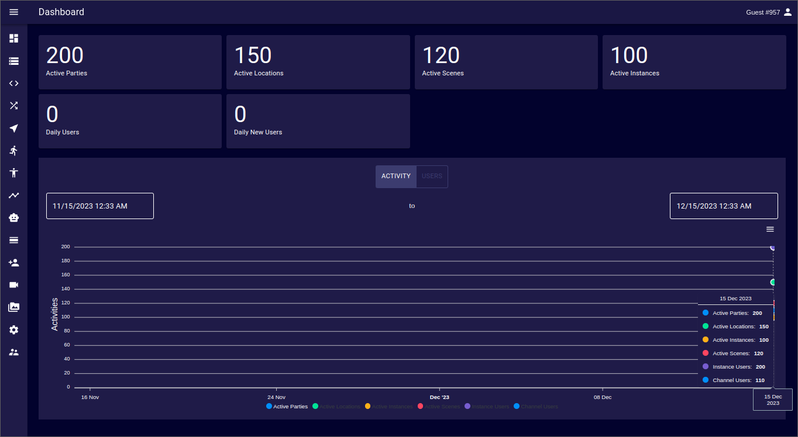

# Dashboard
The Admin Panel Dashboard provides an overview of several performance indicators relevant to an Ethereal Engine's deployment.  
It gives a progress report for how a deployment is performing over a certain period of time based on data captured during the selected period.

## Usage Dashboard
The usage section shows data about the current usage of a deployment:
- Active Parties
- Active Locations
- Active Scenes
- Active Instances
- Daily Users
- Daily New Users

## Usage Time Series
This section gives an overview of the usage of a deployment over the selected period of time.  
By default this period is set to the last 30 days, but it can be changed to start and end at any arbitrary date.
