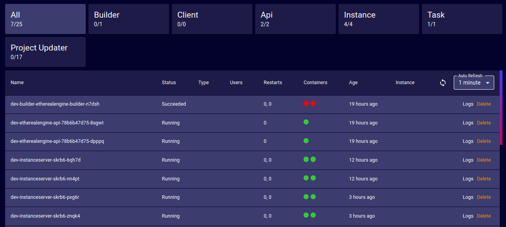

# Servers
<!-- TODO: Confirm that the information given in this section is correct. -->
The Servers page provides a list of all of the servers running in an Ethereal Engine's deployment.

_Note: The labels at the top of the page will filter servers by category when clicked._

For each server, it presents:
- **Name**: The human-readable name given to the server for easier identification.
- **Status**: The current state of the server _(Running, Succeeded, etc)_
- **Type**: The type of server _(Media, World, Unassigned, etc)_
- **Users**: How many users are currently active in the server.
- **Restarts**: The moment in time when the server will next restart.
- **Containers**: How many containers the server is using for its services.
- **Age**: How long the server has been running.
- **Instance**: Handle to the instance that this server is connected to.
