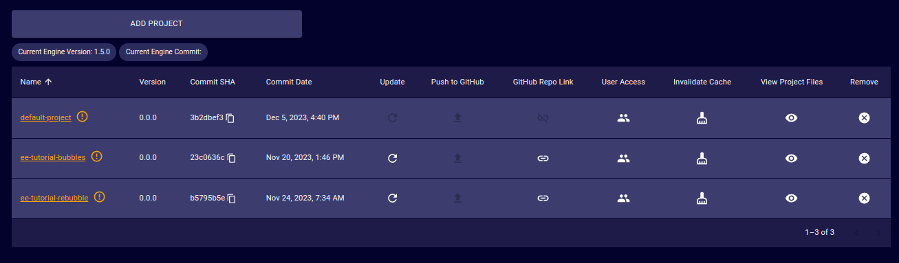
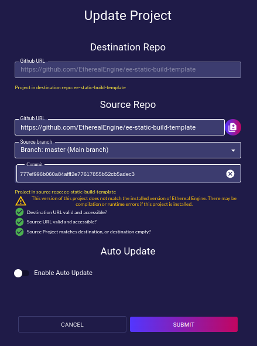

# Projects
<!-- TODO: Confirm that the information given in this section is correct. -->
The Projects page provides a tool to add new projects and list all existing projects of an Ethereal Engine's deployment.

## Project Table
- **Name**:  
  Unique and identifiable name given to the project.

- **Version**:  
  Version that is listed in the `package.json` file of the project.

- **Commit SHA**:  
  `git` commit hash/ID that the project is tracking.

- **Commit Date**:  
  Date when the tracked version of the project was last updated.

- **Update**:  
  Orders the deployment to update the selected project to the latest commit of that project.
  _See the [Update Project](#update-project) section for more info_

- **Push to GitHub**:  
  Uploads the project to a GitHub repository into the current user GitHub account.

- **GitHub Repo Link**:  
  URL of the repository where the project is stored.

- **User Access**:  
  Opens a dialog where access can be given to new users.

- **Invalidate Cache**:  
  Order the deployment to invalidate the storage provider's cache of the selected project.

- **View Project Files**:  
  Opens a dialog that provides a file explorer for managing the file-tree of the selected project.

- **Remove**:  
  Orders the deployment to delete the project from its storage _(no undoing possible)_.

## Managing Projects
### Rebuild the Engine
When to:
- Updating the Engine to latest
- Changes in any of the projects
- Change versions (revert to older or go back to newer)
### Update Project

### Add project
<!-- TODO: Explain and find details of this feature. (devops team) -->

