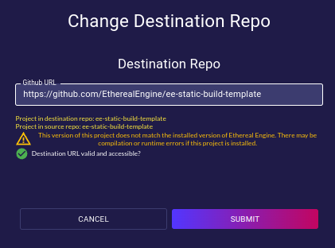
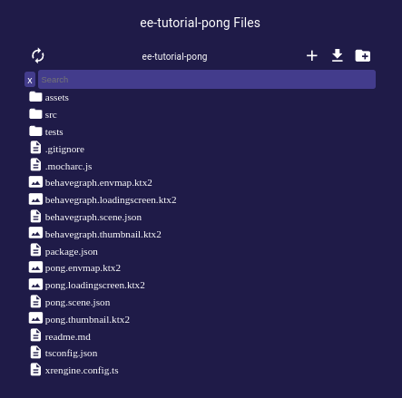
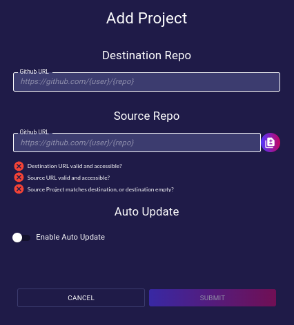

# Projects
<!-- TODO: Confirm that the information given in this section is correct. -->
The Projects page provides a tool to add new projects and list all existing projects of an Ethereal Engine's deployment.

## Project Table
- **Name**:  
  Unique and identifiable name given to the project.

- **Version**:  
  Version that is listed in the `package.json` file of the project.

- **Commit SHA**:  
  `git` commit hash/ID that the project is tracking.

- **Commit Date**:  
  Date when the tracked version of the project was last updated.

- **Update**:  
  Orders the deployment to update the selected project to the latest commit of its repository.  

- **Push to GitHub**:  
  Uploads the project to a GitHub repository into the current user GitHub account.

- **GitHub Repo Link**:  
  Opens a dialog to update the URL of the repository where the project is stored.

- **User Access**:  
  Opens a dialog to create links for giving access to the project to new users.

- **Invalidate Cache**:  
  Order the deployment to invalidate the storage provider's cache of the selected project.

- **View Project Files**:  
  Opens a dialog that provides a file explorer for managing the file-tree of the selected project.

- **Remove**:  
  Orders the deployment to delete the project from its storage _(no undoing possible)_.

## Add project
The Add Project button opens a dialog where new projects can be added to the deployment.  
- **Destination Repo**: .  <!-- TODO: How do these work? -->
- **Source Repo**: .  <!-- TODO: How does these work? -->
- **Copy from Destination Button**:  
  Automatically copies the Destination URL into the Source URL field.
- **Auto Update**:  
  Enable/disable automatic updates for a project when the project's repository gets new commits.  

## Update/Rebuild the Engine
The `Update Engine / Rebuild` action should be activated in the following situations:
- Ordering to update the engine to its latest version available.  
- After making any changes to any of the projects stored in the deployment.  
- After changing between engine versions.  
  _(either when reverting to an older version, or when going back to newer one)_  

