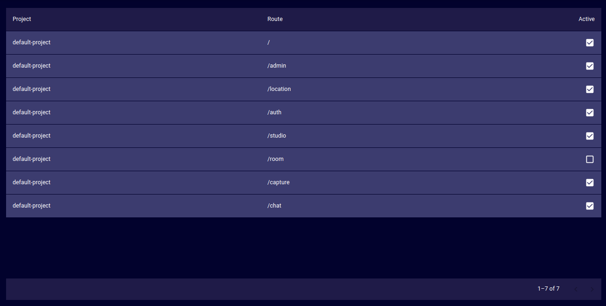

# Routes
The Routes page provides a list of available routes for the deployment.
- **Project**:  
  The project that provides the route.
- **Route**:  
  The path that has to be added to the deployment's root address to open the route.
- **Active**:  
  Controls whether the route is accessible or not.

