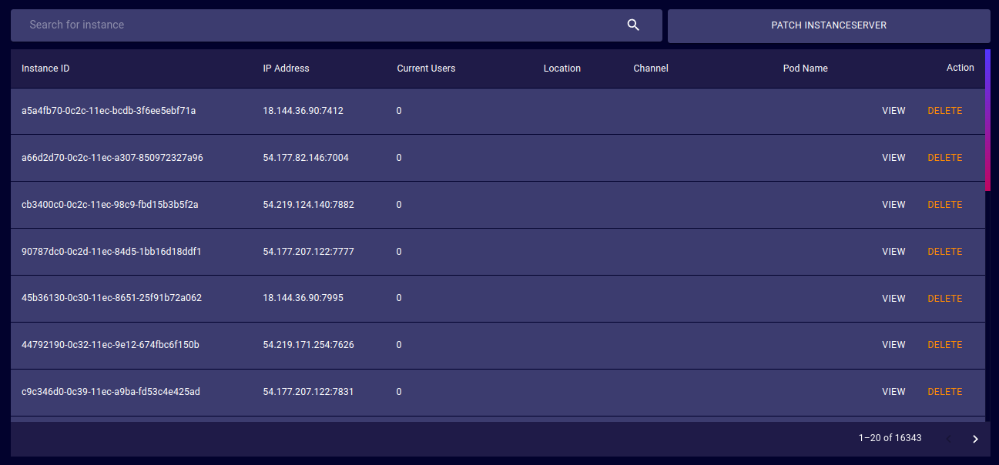
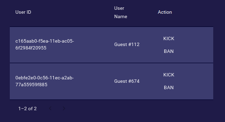
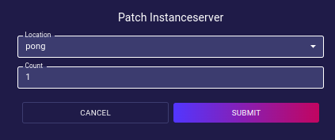

# Instances
The Instances page provides a tool to view and patch existing instance servers running on the deployment.

## Instance Table
- **Instance ID**: Unique ID of the server that is running the Instance.
- **IP Address**: IP Address and Port of the server running the Instance.
- **Current Users**: Number of users currently active in the given location Instance server.
- **Location**: Location that is active in the Instance server.
- **Channel**: Communication channel active in the Instance server.
- **Pod Name**: Name of the Kubernetes pod that is running the Instance server.
- **Action**:  
  - **Delete**: Orders the deployment to close the given Instance server.
  - **View**: Opens a dialog to manage the users of the Instance server.
  
## Patch InstanceServer
<!-- TODO: Properly explain what this is -->
The Patch InstanceServer button opens a dialog that allows the deployment's instance servers to be patched.

