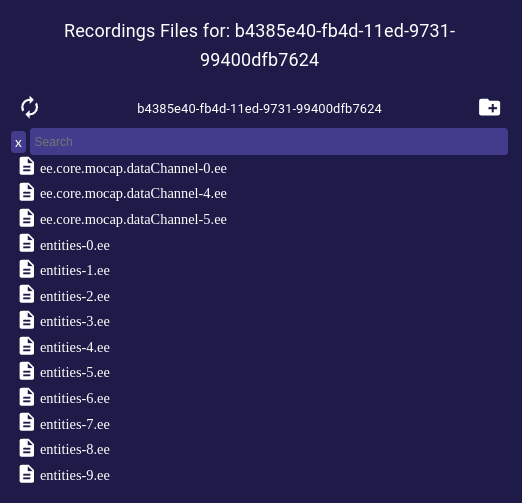

# Recordings
This page provides a tool to manage the Motion Capture (Mocap) recordings of the Ethereal Engine deployment.

- **Recording ID**: Unique ID of the selected Recording.
- **User**: User that recorded the selected Recording.
- **Ended**: .  <!-- TODO: What is this for? -->
- **Schema**: JSON object that contains the data of the selected Recording.  <!-- TODO: What is this for? -->
- **Action**:  
  - **Delete**: Orders the deployment to delete the target Recording _(no undoing possible)_.
  - **View**: Opens a dialog that provides a file explorer for managing the file-tree of the selected Recording.  
  

<!-- TODO: Mocap recordings -->
