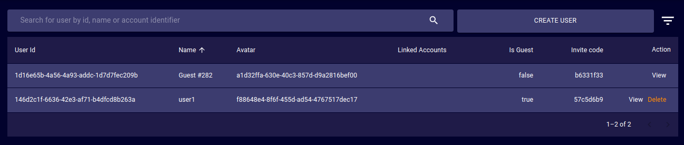
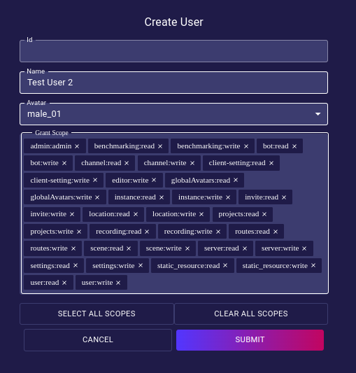
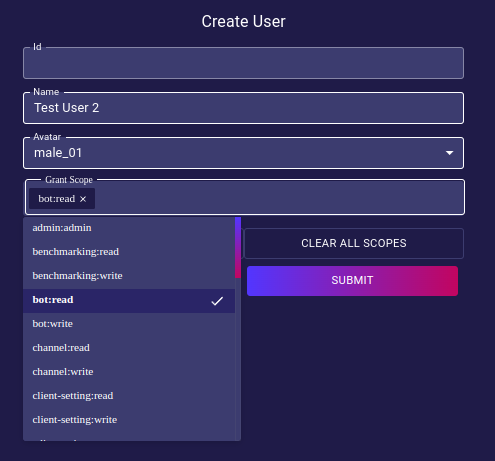

# Users

## Create User

### Name
### Avatar
### Scopes

<!-- TODO: Write explanation to each of the permissions. -->
#### Admin:Admin
#### Benchmarking:read/write
#### Bot:read/write
#### contentPacks:read/write
#### Editor:write
#### globalAvatars:read/write
#### Groups:read/write
#### Instance:read/write
#### Invite:read
#### Location:read/write
#### Party:read/write
#### Projects:read/write
#### realityPacks:read/write
#### Recording:read/write
#### Routes:read/write
#### Scene:read/write
#### Server:read/write
#### Settings:read/write
#### Static_resource:read/write
#### User:read/write
## User Table
