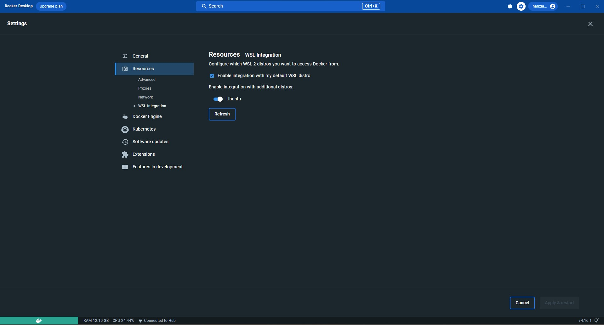

# Installing on Windows with WSL2

This guide is currently tested on Windows 10 (22H2) and Windows 11.

## Install Windows Subsystem for Linux (WSL). 
Remember to run Powershell in Administrator mode either by right clicking and selecting 'Run as administrator' or by typing PowerShell in 'Run' dialog box of Windows and pressing `Ctrl+Shift+Enter` key combination.

Install Ubuntu distribution of Linux by executing the command:
`wsl --install --distribution Ubuntu`
or
Install Ubuntu distribution of Linux from Microsoft Store by using guide [here](https://learn.microsoft.com/en-us/windows/wsl/install).

Alternatively, you can follow these instructions as well:

- [How to install WSL](https://pureinfotech.com/install-wsl-windows-11/)
- [Manual installation steps for WSL](https://learn.microsoft.com/en-us/windows/wsl/install-manual)

Once WSL is installed, make sure to:

- [Set up your Linux username and password](https://learn.microsoft.com/en-us/windows/wsl/setup/environment#set-up-your-linux-username-and-password)
- [Update and upgrade packages](https://learn.microsoft.com/en-us/windows/wsl/setup/environment#update-and-upgrade-packages)
- Verify Ubuntu distribution using the command: 'lsb_release -a'
- You can verify WSL and Ubuntu  installation by using the command in PowerShell: 'wsl -l -v'

## Install Docker Desktop

Install docker desktop with WSL 2 backend. You can find the instructions [here](https://docs.docker.com/desktop/install/windows-install/).

Once docker desktop is installed and running make sure to enable your WSL distribution. You can do so from Docker Desktop App by visiting `Settings > Resources > WSL Integration`. Enable integration with Ubuntu. Make sure to hit 'Apply & Restart'.



## Install Node. 
Run Powershell in Administrator mode. Run Ubuntu using command : `wsl`. After logging on run the following command: `cd ~/` to ensure that the installation of Node and other packages mentioned below is done in Ubuntu.

In your WSL Ubuntu terminal, if node (`node --version`) isn't already installed on your machine. You can do so by first installing `nvm` by running following commands:

```bash
curl https://raw.githubusercontent.com/creationix/nvm/master/install.sh | bash
source ~/.profile

export NVM_DIR="$HOME/.nvm"
[ -s "$NVM_DIR/nvm.sh" ] && \. "$NVM_DIR/nvm.sh"                   # This loads nvm
[ -s "$NVM_DIR/bash_completion" ] && \. "$NVM_DIR/bash_completion" # This loads nvm bash_completion
```

You can verify nvm by using `nvm --version` command. Afterwards, install Node (version between 16.0 and 18.0 both inclusive) by using:

```bash
nvm install --lts
```

You can verify node version by using `node --version` command.

## Install Python 3

In your WSL Ubuntu terminal, if python 3 (`pip3 --version`) isn't already installed on your machine. You can do so by running following commands:

```bash
sudo apt-get update -y
sudo apt-get install -y python3-pip
```

You can verify python3 by using `python3 --version` command.

## Install Make

In your WSL Ubuntu terminal, if make (`make --version`) isn't already installed on your machine. You can do so by running following commands:

```bash
sudo apt-get update -y
sudo apt-get install -y build-essential
```

You can verify make by using `make --version` command.

## Clone Ethereal Engine repo to your local machine

Clone Ethereal Engine repo on your machine by running following command in WSL Ubuntu terminal. You can check the directory in which you are sitting by the command: `pwd`

```bash
git clone https://github.com/etherealengine/etherealengine --depth 1
```
Change directory to the location where etherealengine repo is cloned `cd etherealengine`
If `.env.local` file does not exist in the root of your repo folder then create it by duplicating `.env.local.default`. Command: `cp .env.local.default .env.local`

Afterwards, install npm packages using:

```bash
npm install
```

> Note: If you face issue related to `mediasoup` while doing npm install. Then remove the `mediasoup` package from `packages/instanceserver/package.json` file of Ethereal Engine source code. And run `npm install` again. Afterwards, run:

```bash
npm install mediasoup@3 -w @etherealengine/instanceserver
```

## Initialize MariaDB server

If you are running the engine for the first time then you will need to initialize the database with tables and data. You can do so by running:

```bash
npm run dev-reinit
```

## Start Engine Stack

You can run Ethereal Engine stack by running:

```bash
npm run dev
```
Now run Ethereal Engine in browser by navigating to [this link](https://127.0.0.1:3000/location/default).   
> If it keeps displaying 'loading routes' progress for a long time, it is due to the fact that you have to allow certificates.   
> Open Developer tools in Chrome by clicking the side menu with three dots, then `More tools > Developer tools` (or use `Ctrl+Shift+I`) and then go to the 'Console' tab. You will see some errors in URL address starting with 'wss'. Replace 'wss' with 'https' and open it in new tab. Accept the certificate and reload your Ethereal Engine tab.
