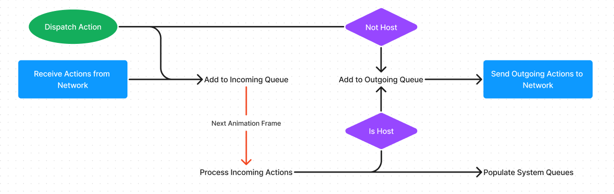

# Event Sourcing

## Actions

Actions are a way to control state changes in your application. Once defined, they can be dispatched, which will then populate the outgoing queue to be processed on the next frame.

All actions are dispatched to a topic, by default this is the **default** topic. Topics are used to specify that actions are to be routed to specific networks.

When an action is dispatched, it is added to the incoming action queue. If it's topic is networked, it is also added to the outgoing queue for it's topic.

At the end of the animation frame, any actions in a network topic's outgoing queue are sent to that topic's network.

If the peer is the host of a networked action's topic, the action is sent to all other peers, otherwise it is just sent to the host. This can be opted out of by specifying the $to property on an action, which informs the host to forward the action only to that user's.

At the start of the next animation frame, action queues are populated with incoming actions. These actions are then processed in the order they were received, by systems in the order the systems are registered.

