# Installing Projects
## Local Install Flow

To install a project locally, clone the repository you wish to install to the 
`/packages/projects/projects/` folder. You can do this with the follow commands:

```
cd packages/projects/projects/
git clone https://github.com/myorg/myrepo
cd myrepo 
code .
```

This will create a folder name `myrepo` which must contain an `xrengine.config.ts`
file, and open the project in a new vscode window (such that git commands can be 
handled by the new window). All you need to do now to run this project is re-run
the stack (with `npm run dev`).

## Graphical Install Flow

Projects can also be installed and managed from the /admin/projects route. You must be
an admin and must have a linked GitHub account, which can be attained by having your
GitHub account linked to your Ethereal Engine account by signing in via GitHub.
(You do not need to have most recently signed in via GitHub, you just have to have
linked your GH account at some point)

See [the section 'How to set up GitHub to install external projects'](../2_devops_deployment/4_setup_github_oauth_for_projects.md)
for instructions on creating an OAuth app from GitHub, installing it into an Ethereal Engine deployment,
and authorizing it to have access to your GitHub organizations.

Click the 'Add Project' button:

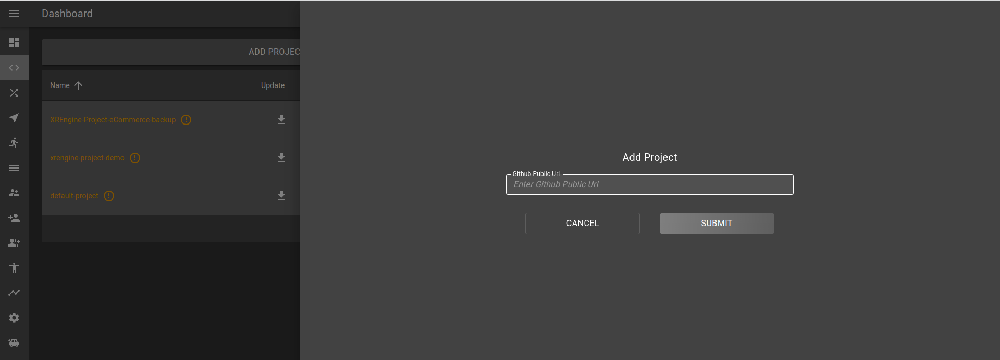

You will see text fields for entering the source and destination repositories.
When you click away from the text fields, the URL will be checked both for the
repository existing, and for whether you have sufficient permission to access
that repository - read permission for the source repo (public repositories are
always available), and write or admin permission for the destination repo. If
you have never logged into GitHub with your current account, you will not be
allowed to add or update projects.

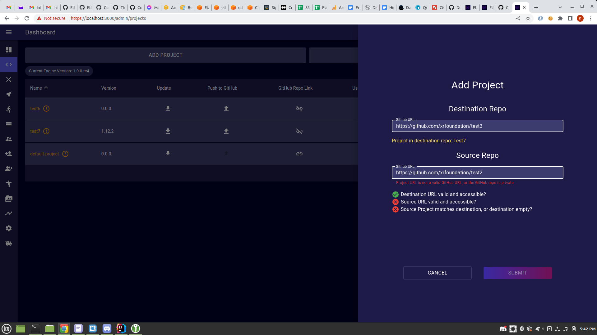

For the source repository, after entering the URL, you will also need to select
a branch to pull from. Your options are either the main branch for that repository,
or a branch that matches the `RELEASE_NAME` of the deployment, e.g. `dev-deployment` for
a deployment with the environment variable `RELEASE_NAME=dev`. If `RELEASE_NAME` is not defined, then
`local` is used; this could lead to multiple local installations of the platform conflicting,
but one can set `RELEASE_NAME` locally to something else in your .env.local file.

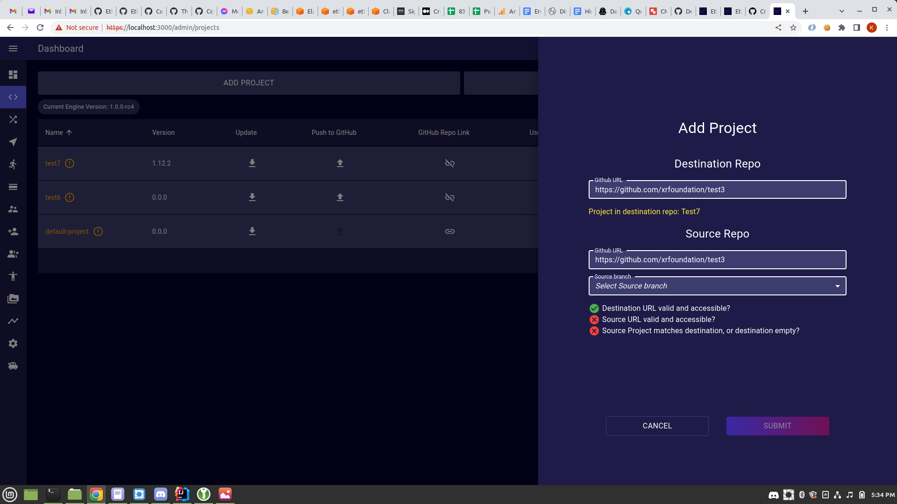

After the branch is selected, you also need to select a tagged commit from that branch, 
or the most recent commit. As of this writing, you must manually tag project commits yourself, 
though tags are copied over from the source repository when installing or updating a project.

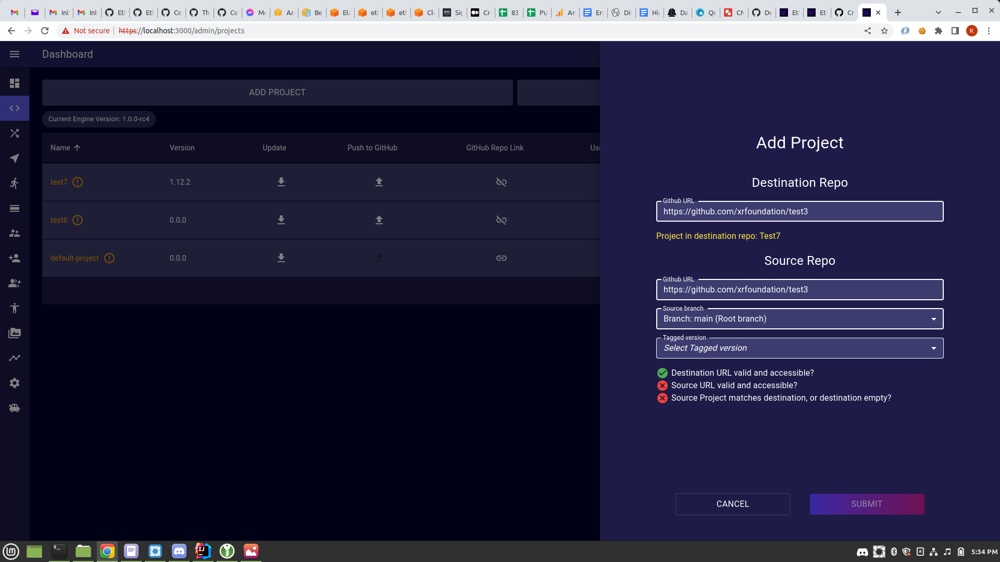

The backend checks that the source and destination repos have the same project.
The project name is the `name` field in the project's package.json file.
If the destination repo's `<RELEASE_NAME>-deployment` branch is empty or nonexistent, then
any project can be uploaded to it. If the destination deployment branch is not empty,
then it can only be updated with different versions of that project. For example,
if the destination branch has project `example1` in it, you will not be allowed to
overwrite it with a project `test3`, only other projects named `example1`.

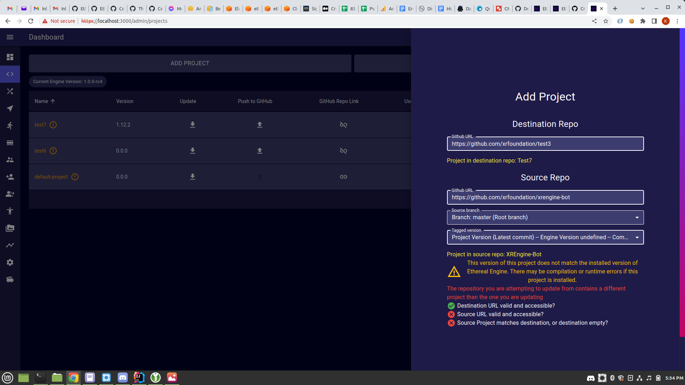

You can only install a project with a given name once, and names are **case-insensitive**;
`example1` is seen as the same name as `ExamplE1`. You would need to remove an existing project
in order to install a different project that has the same name, or rename one of the projects.

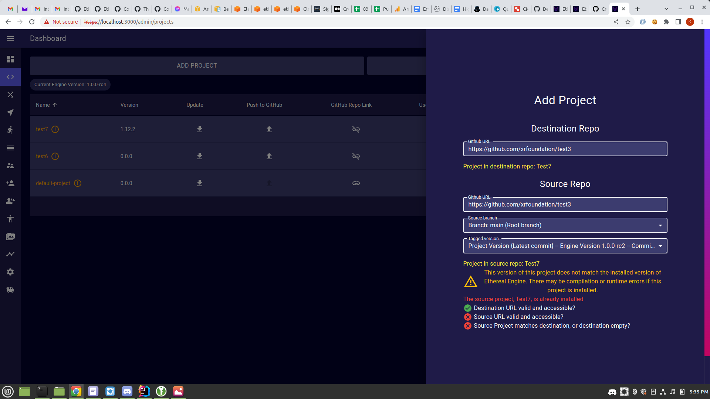

When everything is valid, you will be able to click the Submit button, which will install
the project.

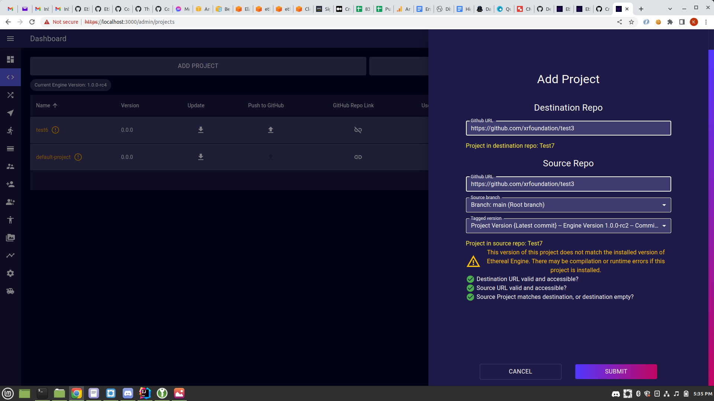

Adding a project through this interface runs `git clone` in the background, same as above, 
but will then upload all of the repository's files to the storage provider. These files will then be 
downloaded and installed to the deployment's file system each time the docker builder 
pod runs. This allows full version controlled access for local development flow
and version locking for production deployment. The source project code will then be force-pushed
to the branch `<RELEASE_NAME>-deployment`, so make sure that there is no work in that branch
that might get overwritten, and make a backup in another branch you do want to save it.

The Push to GitHub button will push the current code for that project to the `<RELEASE_NAME>-deployment`
branch if possible; it will *never* push to the main branch. If there are merge conflicts, it will instead 
make a Pull Request on that branch with the changes; it will NOT force-push anything to this branch, 
unlike adding or updating a project.

The Update button opens the same drawer as adding a new project, just with the destination repository locked in.
Assuming everything matches, it will also force-push to the `<RELEASE_NAME>-deployment` branch in the destination
repository.

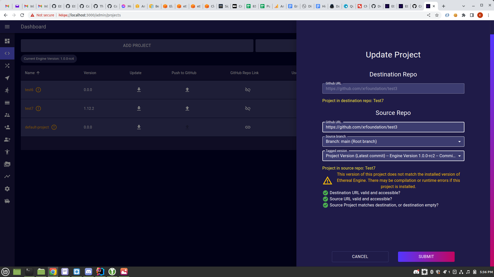

The GitHub Repo Link button also opens this drawer, but you can only select the destination repository, not
the source repository, and no code is pushed anywhere. 

The remove button will remove the folder containing that project. This will not delete the deployment
branch. WARNING: Any uncommitted & unpushed files will be lost.

### Updating the Engine Version and Rebuilding Projects

Making changes to a project is not always reflected immediately in the running code. As of this writing,
project code is built into the client-side and backend files, and changes to project code require that
the codebase be updated. Locally, this just requires you to stop and restart the `npm run dev` command.
In a production environment, this requires that the builder process be restarted, so that it can
rebuild the client and backend code with the new project code.

Changes to scenes in projects do not require a rebuild - since they are stored external to the codebase
in the storage provider, and are downloaded anew by a client each time the scene is loaded, changes to 
scenes will always be immediately available. The act of saving a project will clear any cached version
of the scene's static files, so the client will get the new version.

Additionally, if you want to update the core Ethereal Engine code, you will also need to re-run the builder
process with the new version of the code.

In a production environment, click on the button `Update Engine/Rebuild`. A drawer will open with
a selector for the engine version you want to update with. This will be an image in the builder's
linked image repository.

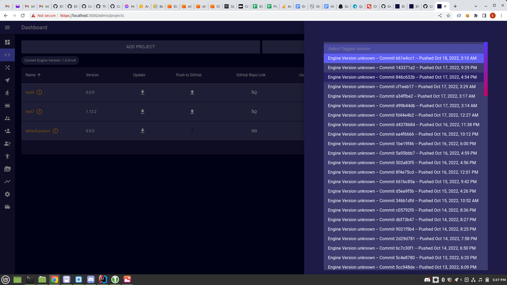

After selecting an engine version, if you click Submit now, you will just rebuild with the 
newly-selected version of the main codebase, plus whatever versions of your projects are currently 
in your linked repositories.

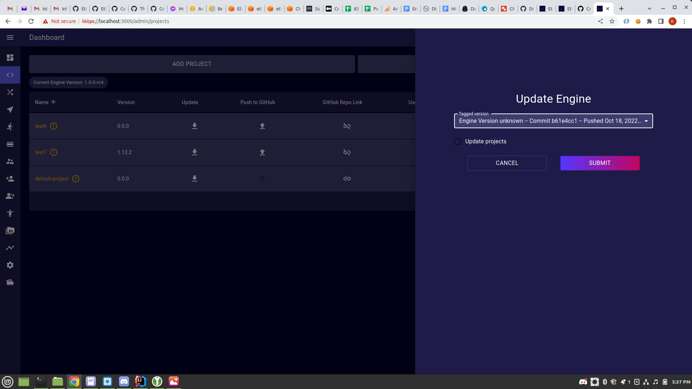

If you click on `Update projects`,
you can select the source commits for any installed projects that have a destination repo, same as with
the Add/Update project drawer. The projects will be updated before the builder is restarted.

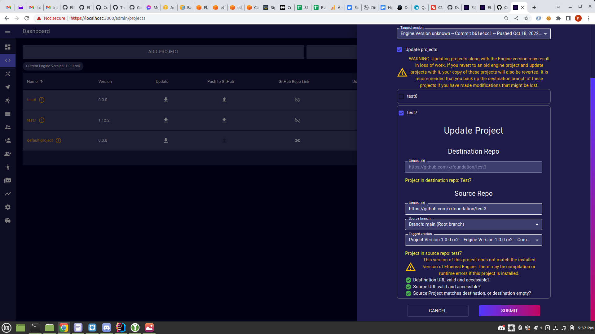
