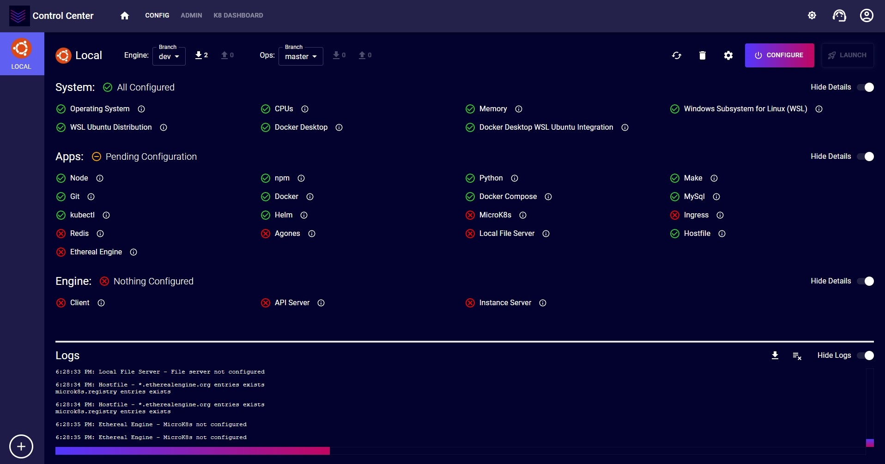
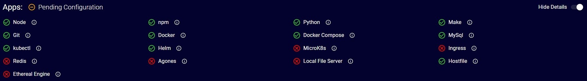
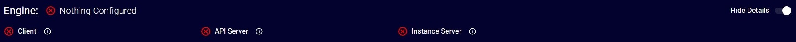
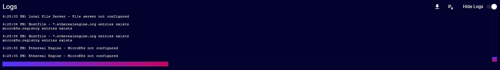
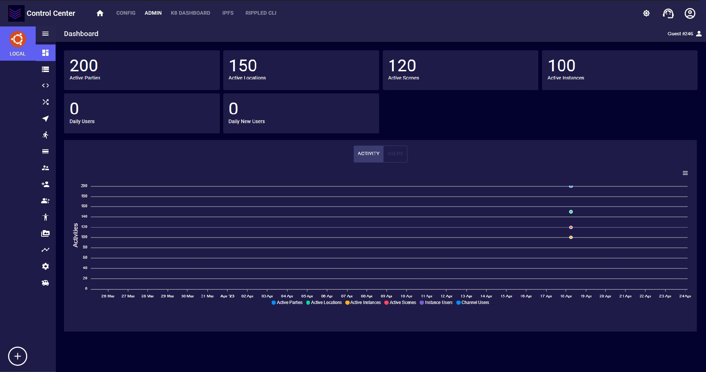
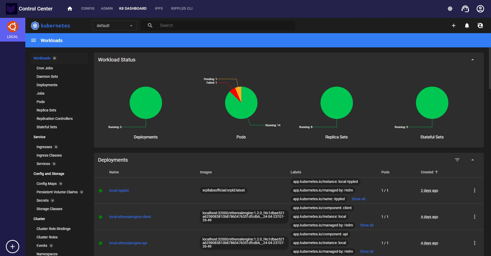
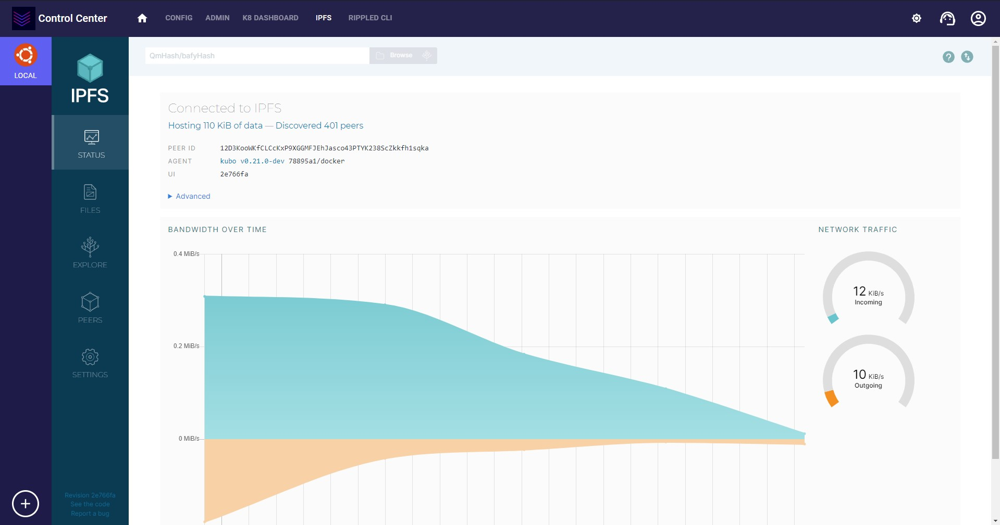
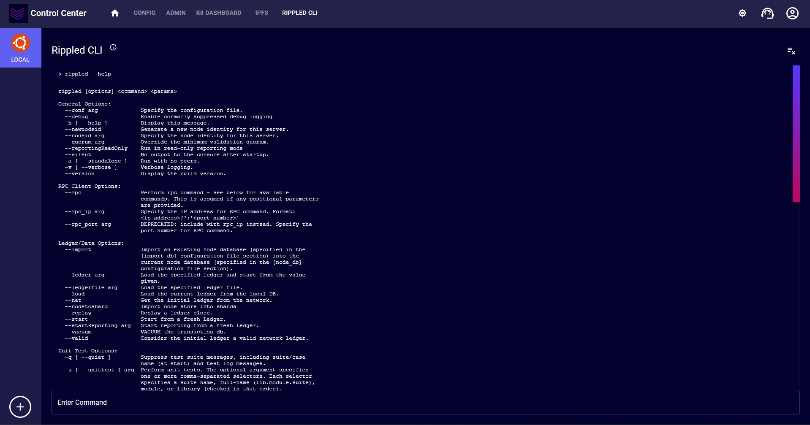

--- 
hide_table_of_contents: true
---

import StepAuthentication from './_step_authentication.md'
import StepConfigurations from './_step_configurations.md'
import StepVariables from './_step_variables.md'
import StepSummary from './_step_summary.md'

# Getting Started

The Ethereal Engine Control Center is a self-contained Metaverse world in a box. Take what you need or launch the full stack. Ethereal Engine Control Center is a desktop app to manage an Ethereal Engine cluster.

We know it's been complicated to build with Ethereal Engine and we've made this tool to give the community easy access to the engine. We would love to see your creations and invite you all to come build with us.

## App Overview

The Ethereal Engine Control Center app provides access to various functionalities which includes:

- Configure your Ethereal Engine in a cluster in just a few clicks.
- View status of Ethereal Engine dependencies on your local system.
- Manage an Ethereal Engine deployment through admin panel.
- Manage kubernetes cluster through its dashboard.
- Manage IPFS node running in the cluster.
- Execute commands against rippled server.
- See realtime logs of different actions being performed.

## 1. Downloading Control Center App

In order to download Ethereal Engine control center app, navigate to **<u>[releases](https://github.com/etherealengine/Ethereal-Control-Center/releases)</u>** page and download the latest version of App. On Windows, you will need to download `.exe` while for linux download `AppImage`.

> On Windows, you will need to allow permission for executing ps1 scripts. You can do so by running following command in Powershell with admin privileges ([reference](https://github.com/EtherealEngine/etherealengine-control-center#2-windows-permission-to-run-ps1-scripts)).
> ```Powershell
> Set-ExecutionPolicy -ExecutionPolicy Unrestricted
>```

> On Linux, once downloaded, right click and go to **Properties** of AppImage. In **Permissions** tab check 'Allow executing file as program'. Afterwards, double click on AppImage to launch the app.

> On Ubuntu 22.04 or later, if you are unable to launch AppImage then you might have to install Fuse using following command in terminal ([reference](https://github.com/EtherealEngine/etherealengine-control-center#1-app-not-launching-in-ubuntu-2204)).
> ```bash
> sudo apt-get install fuse libfuse2
>```

## 2. Launch & Create Cluster

When you launch the app for the first time, you will see below screen.


Here you need to create a cluster. You can do so by clicking on 'Create' button in the center or anytime using round plus button on left bottom corner (in hotbar) of the screen. Following are the different sections of create custer wizard.

### Step 1 - Cluster Information


In this step, you will need to provide following information:

- **Cluster Name:** This can be any name you want to give your cluster. i.e. Local, my-metaverse, etc.

- **Cluster Type:** This will be the local kubernetes distribution you want to use. MicroK8s is recommended.

    > Currently, `MicroK8s` is supported on Windows & Linux while `Minikube` is supported on Linux.

- **Prerequisites:** These are a set of items that should be manually configured by the user. If an item is correctly setup then its status will be green tick, else it will have a red cross with details and link to docs for the corrective measures.
    > Currently, there are no prerequisites for native Linux.

### Step 2 - Authentication


<StepAuthentication />

### Step 3 - Configurations


<StepConfigurations />

### Step 4 - Variables


<StepVariables />

### Step 5 - Summary


<StepSummary />

- **Create:** By default you should go with this option as it will create the cluster entry and show the current status of things.

- **Create & Configure:** This will create the cluster entry and show the current status of things. And afterwards it will automatically start the configuration script to ensure things are setup.

>> If you use 'Create' option, then you can still run the Configure script as discussed later in this [guide](#4-configure-cluster).

## 3. Cluster Screen



Once you created a cluster you will be navigated to its screen also know as config page. Lets explain various sections of this screen:

### 1. Hotbar


It will show you a list of all clusters you have created. You can click on each of them to view the cluster screen of them.

 The plus icon at the bottom of this bar is used to create a new cluster.

### 2. Navbar


This section allows navigation and various utility options. Following are the various options in it:

- **App Icon:**  Logo of this application.

- **Home Icon:**  Allows to navigate to home.

- **Config:** Navigates to main dashboard of selected cluster.

- **Admin:** Navigates to ethereal engine admin panel of selected cluster.

- **K8 Dashboard:** Navigates to kubernetes web dashboard of selected kubernetes distribution.

- **IPFS:** Navigates to IPFS web UI of selected cluster. This option is enabled only if ripple stack is enabled.

- **Rippled CLI:** Navigates to rippled server cli of selected cluster. This option is enabled only if ripple stack is enabled.

- **Change Theme Icon:**  Allows to toggle between vaporware, light & dark themes. The color scheme of these themes are similar to ethereal engine.

- **Support Icon:**  Opens a dropdown menu to allow reaching out to support via Discord or Github.

- **User Icon:**  The functionality for this button is coming soon.

### 3. Options Panel


This section shows various actions against currently selected cluster. Following are the various options in it:

- **Cluster Icon:**  Logo of the selected cluster type. If can be MicroK8s or Minikube logo.

- **Cluster Name:** This is the cluster name that you entered in create cluster dialog. i.e. Local.

- **Engine Git Status:**  This is used to view current status of local ethereal engine github repo. You can view & change current branch, view & pull incoming changes, view & push outgoing changes.

- **Ops Git Status:**  This is used to view current status of local ethereal engine ops github repo. You can perform all actions as explained for engine git status.

- **Refresh Icon:**  This will recheck the status of prerequisites, system, apps & engine. It also, recheck the status of engine and ops git repos. If a refresh is already in process then it will be disabled until its finished.

- **Delete Icon:**  This will delete a clusters. It would not make any changes in associated local kubernetes, app, etc.

- **Settings Icon:**  This will open settings dialog. It contain some cluster specific settings in addition to app settings.

- **Configure Button:**  This will open the configure dialog which we will discuss in detail later. If a configuration is already running then this button will be disabled and have a spinner in it.

- **Launch Button:**  Once all the tick marks in control center are green and launch button is enabled. This button will open Ethereal Engine's location in your browser.

    > Make sure to allow certificates as explained **<u>[here](https://etherealengine.github.io/etherealengine-docs/docs/installation/install_troubleshooting#invalid-certificate-errors-in-local-environment)</u>**.

### 4. System Status


This section will show the current status of whether the system requirements are meet or not. On Windows, it will also show the status of prerequisites.

The status against each item will be displayed. You can find more details by hovering over  info icon. This is useful when some item is not configured correctly.

### 5. Apps Status



This section will show the current status of all the apps required to run ethereal engine deployment.

### 6. Engine Status



This section will show the current status of various components of ethereal engine deployment.

### 7. Logs



This section will show all the logs of current session. The logs are of the different actions being performed by control center and their output.

- **Download Button:**  This will download all displayed logs.

- **Clear Button:**  This will clear all displayed logs.

## 4. Configure Cluster

On cluster screen, if any of the status is not green tick then it means you need to run the configure script to fix them automatically. To do so use the Configure () button in the options panel. Following are the different sections of create custer wizard.

> Its always recommended to clear your logs before running configure script in order to trace outputs easily.

### Step 1 - Authentication


<StepAuthentication />

### Step 2 - Configurations


<StepConfigurations />

### Step 3 - Variables


<StepVariables />

### Step 4 - Summary


<StepSummary />

- **Configure:** This will start the configuration script which will ensure things are setup. You can track output of various things in [logs](#7-logs). Depending on your system and status of apps, it can take a while to setup things. As the configure script run the Configure () button will be disabled and have a spinner in it.

    > Once the script finished its execution, the status cluster will be automatically refreshed.

    > If the configure script failed, pay close attention to last lines of [log](#7-logs) section. As it will contain the reason why script failed.

## 5. Admin Dashboard



Once, everything is configured correctly and all ticks are green on config page ([Cluster Screen](#3-cluster-screen)) then you can click on `Admin` button in [navbar](#2-navbar). This will show the admin dashboard of ethereal engine deployed in your local k8s cluster.

You can perform various actions from admin dashboard including installing projects, managing users, groups, locations, instances, resources, etc.

## 6. K8 Dashboard



Once, your selected local k8s (Microk8s or Minikube) has a green tick on config page ([Cluster Screen](#3-cluster-screen)) then you can click on `K8 Dashboard` button in [navbar](#2-navbar). This will show the k8s dashboard.

When you launch it for the first time then you will be asked regarding token configurations. You can use `Skip` button to pass through it.


You can perform various actions from k8s dashboard including managing pods, jobs, deployments, services, etc.

## 7. IPFS



If ripple stack is enabled and once, IPFS has a green tick on config page ([Cluster Screen](#3-cluster-screen)) then you can click on `IPFS` button in [navbar](#2-navbar). This will show the IPFS web UI.

You can view and manage various aspects of the IPFS running in your local cluster using this dashboard. IPFS is not required by default for engine, though for custom use cases it can be used.

## 8. Rippled CLI



If ripple stack is enabled and once, Rippled has a green tick on config page ([Cluster Screen](#3-cluster-screen)) then you can click on `Rippled CLI` button in [navbar](#2-navbar). This will show the Rippled CLI page.

You can run various commands against `rippled` server and view their outputs. Rippled is not required by default for engine, though for custom use cases it can be used.

## 9. Updating the App

Every time you launch control center app it will check for the latest version of the app. If there is any new updated it will prompt to update. Its always recommend to use the latest version of the app.
