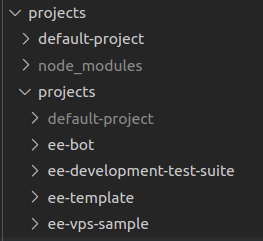

# Projects

Projects are folders that contain all your custom code, assets and scenes.
They are version controlled using git & github, and can be installed to any deployment
with a single click.  
_(more information about this on the [Locations chapter](/manual/concepts/locations) of the `Creator Manual`)_

Pictured below is an example of 4 projects installed.
By default, only the `default-project` is installed, which in a production environment is read only.
You can find the default project under `/packages/projects/default-project/`

In a production environment:
- The builder process will install all projects according to the `project` database table
- The builder process will download files from the storage provider.

In a local development environment:
- The local file system is always the source of truth.

To ensure that there is no accidental loss of data, any project folders added or removed from the file system will be automatically added or removed from the database. These project folders are also git repositories.



## File Structure
Projects have a few conventions.
- `assets/` is where files uploaded from the editor will be uploaded to
- `src/` is where code assets can be served from
- `tests/` is where test files can be run
- `sceneName.scene.json` is a scene file
- `sceneName.thumbnail.png` is an auto-generated scene thumbnail file
- `xrengine.config.ts` the project configuration, where client routes, database models, feathers services and the project thumbnail can be defined

A project must also have a package.json to provide custom dependencies, and to define the project name, project version, and Ethereal Engine version it is known to work with.

Systems imported from a scene MUST have their filename end with `System.ts` and be in the `/src/systems` folder.
This is to optimize vite's code-splitting bundling process, as each potentially dynamically importable file will result in a new bundle with it's own copy of all of it's import dependencies.

`@etherealengine/*` monorepo dependencies will be symlinked and not needed, but some package managers _(such as pnpm)_ require these to be defined.
If so, they should be defined in `peerDependencies` and kept up to date with the current engine version.

## Config
The ethereal engine config file has the following options:

```ts
export interface ProjectConfigInterface {
  onEvent?: string
  thumbnail?: string
  routes?: {
    [route: string]: {
      component: () => Promise<{ default: (props: any) => JSX.Element }>
      props?: {
        [x: string]: any
        exact?: boolean
      }
    }
  }
  webappInjection?: () => Promise<{ default: (props: any) => void | JSX.Element }>
  worldInjection?: () => Promise<{ default: () => Promise<void> }>
  services?: string
  databaseSeed?: string
  settings?: Array<ProjectSettingSchema>
}
```

### Hooks
The `onEvent` property is a relative path string that points to a file which 
must expose an object with properties as follows:

```ts
export interface ProjectEventHooks {
  onInstall?: (app: Application) => Promise<any>
  onLoad?: (app: Application) => Promise<any>
  onUpdate?: (app: Application) => Promise<any>
  onUninstall?: (app: Application) => Promise<any>
  /**
   * get oEmbed for active routes that match URL
   * return that project's onOEmbedRequest()
   * if null, return default
   */
  onOEmbedRequest?: (app: Application, url: URL, currentOEmbed: OEmbed) => Promise<OEmbed | null>
}
```

These functions are called when the project they belong to are installed, 
updated (such as scenes saved) or uninstalled respectively. This is used in the 
default ethereal engine project to install the default avatars. 
See `/packages/projects/default-project/projectEventHooks.ts`.

### Thumbnail
The `thumbnail` property is a string that must contain a URL to an image that will be used as the Studio thumbnail for the project.

### Routes
The `routes` property enables users to customise the various URL paths of their website utilizing dynamic loading of modules.
- Key: Represents the path _(with leading forward slash included)_ to the resource,
- Value: Represents a react component object which gets wrapped with `React.lazy()`
- `props`: Passes options into the `react-dom-router.Route` component corresponding to the route.

### Webapp Injection
The `webappInjection` property allows logic to be run on all pages, and it is loaded before any routes are loaded.
This will soon be extended to allow easy stylesheet injection and other configurables of the webapp.

### World Injection
The `worldInjection` property allows logic to be run every time a new world is created  
_(note: currently only when the engine is initialised)_.  
This logic is loaded on all instances of the engine, such as a location and the editor.  

An example use case of this property would be registering custom scene loader and editor prefabs.

### Services
The `services` property is a relative path that points to a file which:
- Must return the type `((app: Application) => Promise<any>)[]`  
  This return type will be run on all instanceservers and api servers at startup.

This property allows users to expose custom Feathers services, or whatever other functionality they may need.

### Database Seeding
The `databaseSeed` property is:
- A relative path that points to a file which must return the type `ServicesSeedConfig`  
  _from `../packages/common/src/interfaces/ServicesSeedConfig.ts`_  
  This return type is run when the database seeder is run.

### Internationalization _(i18n)_
Internationalization can be added by using the pattern `./i18n/<language>/<namespace>.json`.  
An example of the format can be found in [the base i18n files](https://github.com/etherealengine/etherealengine/tree/dev/packages/client-core/i18n).
