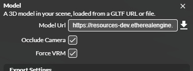
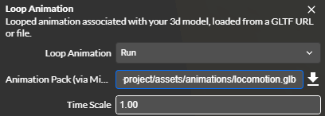
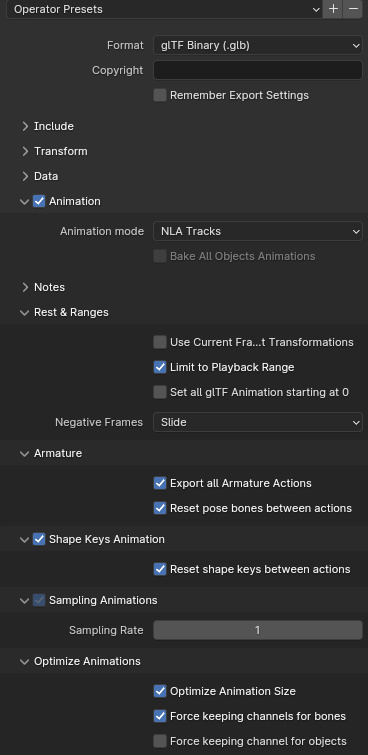
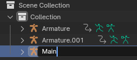
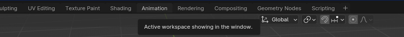
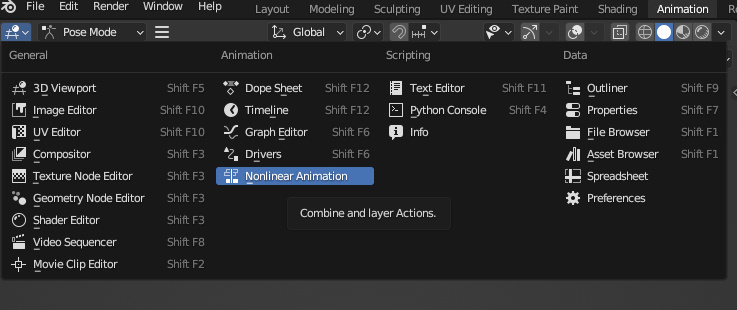
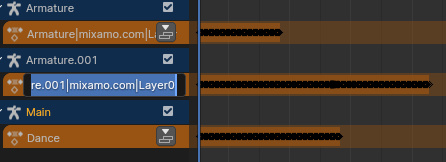
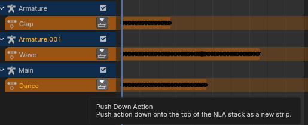
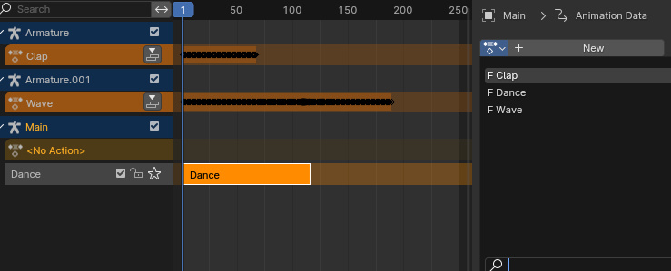
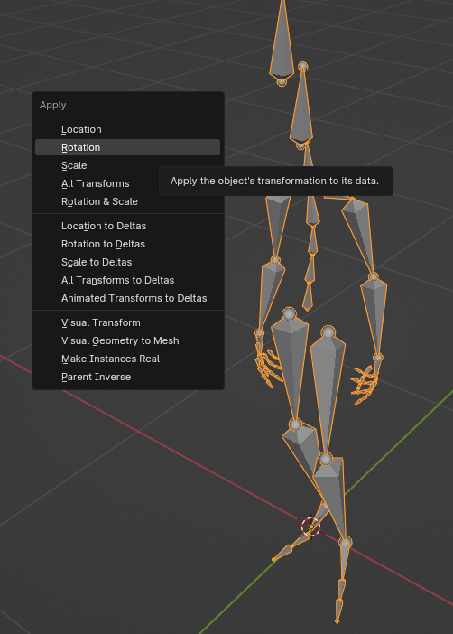

# Animations

## VRM Retargeting

Avatars use the VRM specification to assign humanoid bones. All major humanoid bones are assigned, or matched, to keys of a humanoid bones object. Bone matching ensures guaranteed access to specific avatar bones by consistent keys.

Non-VRM avatars (GLTF) are also supported if the avatar’s rig follows a Mixamo naming scheme as a fallback for bone matching.

VRM 0 and VRM 1 are both supported by the engine. All VRM 0 avatars will be rotated 180 degrees before having their normalized bones recalculated to ensure they are facing the correct direction.

## Pose Spaces

The VRM specification uses two pose spaces, “raw” and “normalized.” Each pose space is represented by its own rig, accessible from the `AvatarRigComponent`.

The raw bone pose space uses quaternion rotations that represent the actual directions of the bones relative to the world up, and is affected by world space transformations of the avatar.

For this reason, world space positional data for avatar bones should be sourced from the raw rig.

The normalized bone space uses quaternions that are relative to the bind pose of the avatar and is unaffected by world space transformations of the avatar. Quaternion rotations and root transforms written to the normalized rig are retargeted to the raw rig.

All transforms written to an avatar should be written to the normalized rig for consistency's sake. This guarantees the transformation will have the same effect across all avatars. This consistency extends to reading a rotation value for a given bone.

## Using Animations
Avatars can be animated via forward kinematics, e.g., [Mixamo animations](https://www.mixamo.com/#/?page=1&type=Motion%2CMotionPack), or procedurally, with [inverse kinematics](./IK). Player avatars are animated via animation actions that blend animations using [animation graphs](#animation-graphs). You may also place non-player avatars in the studio, which can be [animated with the loop animation component](#creating-animated-avatars-in-the-studio).

### Animation Graphs
Avatar animations are played in a networked capacity by dispatching the `AvatarNetworkAction.setAnimationState` action with the name of the preloaded animation pack file, the name of the track from the pack to play, and the avatar entity to apply it to. Optional properties include whether to loop the animation and its layer. Higher layer values override animations at lower values, where the base locomotion animations are layer 0.

### Creating Animated Avatars In The Studio
Using the studio, once your avatar is placed in the location, add a loop animation component. If your avatar has its own bundled animation tracks, you may select one in the animation dropdown of the loop animation component. If you'd like to use retargeted Mixamo animations, ensure that the 'Force VRM' is true.

Next, add a URL to an animation pack, then select the animation clip you want to play from the dropdown. You may use either of the two preexisting animation packs in the assets/animations directory of the default project, or [create your own](#creating-animations).

## Creating Animations
This is the recommended workflow for exporting avatar animations, using Blender.

### Export Setup
When you are ready to export your animation file as GLB, the export will require some minor settings changes to ensure the root motion and animation tracks are exported correctly. 

First, ensure the armature you’re exporting has all transforms applied. An unapplied rotation value will cause root motion axis misalignments. To fix this, press **CTRL+A**, and select **Rotation** to apply the current rotation.

In the GLB export window, you must set the following values.

If you are using NLA tracks, set the **Animation mode** dropdown to **NLA Tracks**, otherwise set it to **Actions**.

In **Rest & Ranges**, select **Limit to Playback Range**. This prevents further root motion axis issues.

### Creating Animation Packs
When multiple Mixamo animation files are present with a single track, it is best practice to bundle them into one GLB with multiple animation clips. You may also want to import custom animations via the Mixamo rig for retargeting onto avatars. This is the recommended workflow using Blender.

#### 1. Import every Mixamo animation into a single Blender scene
- Delete meshes bound to the rigs, if any.
- Choose one of the imported animated rigs to be your main rig, which will hold the animation clips of every other imported rig. 
- Optionally, you may rename the main rig to keep track of it.

#### 2. Start packing the animations into the main rig
- Open the **Animation** workspace tab

- In the top right, in the window adjacent to the viewport, open the editor type window and select **Nonlinear Animation**

- Double-click the name of every animation action to rename it to describe itself, if necessary.

- For the main rig in the NLA editor, click the **Push Down Action** button to create an NLA strip out of the action.

- This process will be repeated with the animation action of every other animated rig you’ve imported. This will require adding their animation actions to the main rig. After pushing down the top action, you will see a new **<No Action>** entry appear.

- Click the **<No Action>** entry, then select the small icon next to the New button to browse actions. Select one that hasn’t been assigned to the main rig yet.
- This will add it to the top action. Push it down and repeat the process until every action has an NLA strip under the main rig.
Now the animations have all been bundled into one rig. Prep the rig and export it.
- Delete every rig except for the main rig. 
- Select the main rig, press **CTRL+A** to open the Apply Transform menu and select **Rotation**. This will ensure the armature object’s rotation is zeroed out to prevent root motion axis misalignments.

#### 3. Export as GLB
- Ensure that your export settings are correct for proper root motion and animation export, see [Export Setup](#export-setup).
