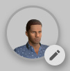
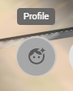
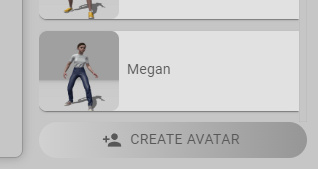
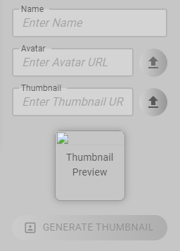
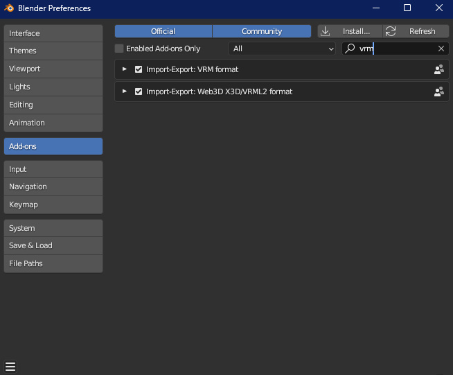
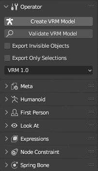
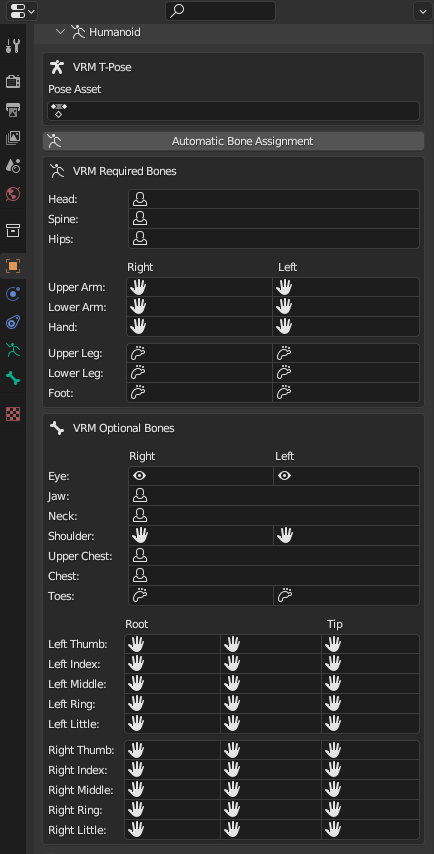

# Models

## Creating Avatars
Learn how to create your own unique avatar using the Ready Player Me or Avaturn integration, in addition to uploading either of the two supported avatar formats.
### Supported Formats
Supported avatar formats are VRM 0.0/1.0, and any GLTF based avatar with a rig following Mixamo naming conventions.

## Using Avaturn or Ready Player Me
Avaturn and Ready Player Me are both available as options for custom avatars, and are easily accessible in the Create Avatar menu, by clicking the edit button in the profile menu.

# Uploading Avatars
If you have a supported avatar ready, you may upload and set it as your avatar with the following steps:
#### 1. Open the profile menu

#### 2. Click the edit button

#### 3. Click the "CREATE AVATAR" button

#### 4. Click the upload button and select your avatar file

#### 5. Generate a thumbnail and write a name
#### 6. Click the save button

## Converting Avatars to VRM
If your avatar model is not a VRM, and is not a Mixamo rig, conversion is necessary.

This is the recommended workflow for converting an avatar model to VRM using the [VRM Add-on For Blender](https://vrm-addon-for-blender.info/en/).
### 1. Install The Plugin
Download the [VRM Add-on For Blender](https://vrm-addon-for-blender.info/en/) plugin, then install the downloaded plugin zip file in the add-ons tab of Blender's preferences menu.

### 2. Configuring
Import your avatar model into Blender. In the layout workspace, press N on your keyboard to open the sidebar, where the VRM settings are located. Here you may choose whether you're using VRM version 0.0 or 1.0. Both are supported by the engine.

### 3. Creating The VRM
In the object properties tab, assign the rig’s bones to the corresponding VRM required names.

If you’ve matched the bones correctly, you will be able to export your avatar as a valid VRM.

