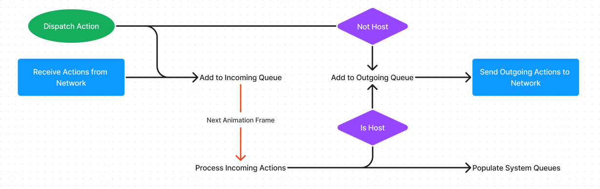

# Event Sourcing

## Actions
Actions are a way to control state changes in your application.  
Once defined they can be dispatched, and doing so will populate the outgoing queue that will be processed on the next frame.

All actions are dispatched to a topic _(the **default** topic when no other topic is specified)_.  
Topics are used to specify which actions will be routed to specific networks.

When an action is dispatched, it is added to the incoming action queue.  
If this action's topic is networked, the action is also added to the outgoing queue for that topic.

At the end of an animation frame, any actions stored in a network topic's outgoing queue will be sent to the network associated with that topic.

If the peer is the host of a networked action's topic, the action will be sent to every other peer. If not, the action will be sent only to the host. This can be opted out of by specifying the `$to` property on an action, which informs the host to forward the action only to that user.

Action queues are populated with incoming actions at the start of the next animation frame.  
These actions will be processed in the order in which they were received, by their respective systems in the order in which those systems were registered.

