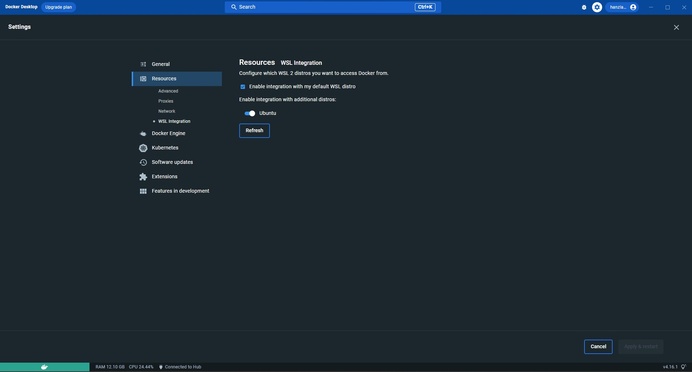

import CloneInstructions from '../_partials/cloneInstructions.md'
import AcceptCertificates from '../_partials/acceptCertificates.md'
import PythonUbuntu from '../_partials/pythonUbuntu.md'
import MakeUbuntu from '../_partials/makeUbuntu.md'

# Installing on Windows with WSL2

This guide has been tested on Windows 10 (22H2) and Windows 11.

## Install Windows Subsystem for Linux (WSL). 
Remember to run Powershell in Administrator mode either by right clicking and selecting `Run as administrator` or by typing PowerShell in `Run` dialog box of Windows and pressing `Ctrl+Shift+Enter` key combination.

Install Ubuntu distribution of Linux with one of these options:
- `wsl --install --distribution Ubuntu`
- Follow the [WSL installation guide](https://learn.microsoft.com/en-us/windows/wsl/install)
- [How to install WSL in Windows 11](https://pureinfotech.com/install-wsl-windows-11/)
- [Manual installation steps for WSL](https://learn.microsoft.com/en-us/windows/wsl/install-manual)

Once WSL is installed, make sure to:
- [Set up your Linux username and password](https://learn.microsoft.com/en-us/windows/wsl/setup/environment#set-up-your-linux-username-and-password)
- [Update and upgrade packages](https://learn.microsoft.com/en-us/windows/wsl/setup/environment#update-and-upgrade-packages)
- Verify the Ubuntu distribution with the command: `lsb_release -a`
- You can verify your WSL/Ubuntu installation by executing this command in PowerShell: `wsl -l -v`

## Install Docker Desktop
Install docker desktop with the WSL 2 backend.
You can find the instructions [here](https://docs.docker.com/desktop/install/windows-install/).

Make sure to enable your WSL distribution once docker desktop is installed and running.  
You can do so from Docker Desktop App by visiting `Settings > Resources > WSL Integration`.
Enable integration with Ubuntu, and make sure to hit `Apply & Restart`.



## Install Node
If Node is not already installed on your machine _(check with `node --version`)_, you can do so by first installing `nvm` and then installing Node with nvm.
> **Important**:   
> Make sure that the commands in this section are run inside Ubuntu WSL.  
> To ensure that this is the case, there are two options:
> 1. Launch WSL manually:  
>     1. Run Powershell in Administrator mode and run Ubuntu using the command: `wsl`.  
>     2. After logging in to Ubuntu, run the command: `cd ~/`  
> 2. Open your application menu and search for `Ubuntu Terminal`

To install `nvm`, run the following commands in your WSL Ubuntu terminal:
```bash
curl https://raw.githubusercontent.com/creationix/nvm/master/install.sh | bash
source ~/.profile

export NVM_DIR="$HOME/.nvm"
[ -s "$NVM_DIR/nvm.sh" ] && \. "$NVM_DIR/nvm.sh"                   # This loads nvm
[ -s "$NVM_DIR/bash_completion" ] && \. "$NVM_DIR/bash_completion" # This loads nvm bash_completion
```
Verify that `nvm` was installed correctly by using the command: `nvm --version`.  
Afterwards, install Node _(version between 16.0 and 18.0 both inclusive)_ with:
```bash
nvm install 18
```
You can verify your Node version with the command: `node --version`.

<PythonUbuntu />

<MakeUbuntu />

## Clone Ethereal Engine repo to your local machine
Clone Ethereal Engine repo on your machine by running the following command from your WSL Ubuntu terminal:
<CloneInstructions />

Change directory to the location where `etherealengine` repository is cloned with:
```bash
pwd                 # Prints the current working directory
cd etherealengine   # Change directory to `etherealengine`
```
If an `.env.local` file does not exist in the root of your Ethereal Engine repository folder, then create it by duplicating the `.env.local.default` file:
```bash
cp .env.local.default .env.local
```

Afterwards, install npm packages with:
```bash
npm install
```

> Note: If you find issues related to `mediasoup` when running `npm install`, then:
> - Remove the `mediasoup` package from `packages/instanceserver/package.json` file of Ethereal Engine's source code.
> - Run `npm install` again.
> - Run: `npm install mediasoup@3 -w @etherealengine/instanceserver`

## Initialize MariaDB server
You will need to initialize the engine's database with tables and data if you are running the engine for the first time. You can do so with:
```bash
npm run dev-reinit
```

## Start the Engine
Run the Ethereal Engine's stack with:
```bash
npm run dev
```
If everything went well, you will now be able to open Ethereal Engine in your browser by navigating to [this link](https://localhost:3000/location/default).  

## Accept Certificates
<AcceptCertificates />
