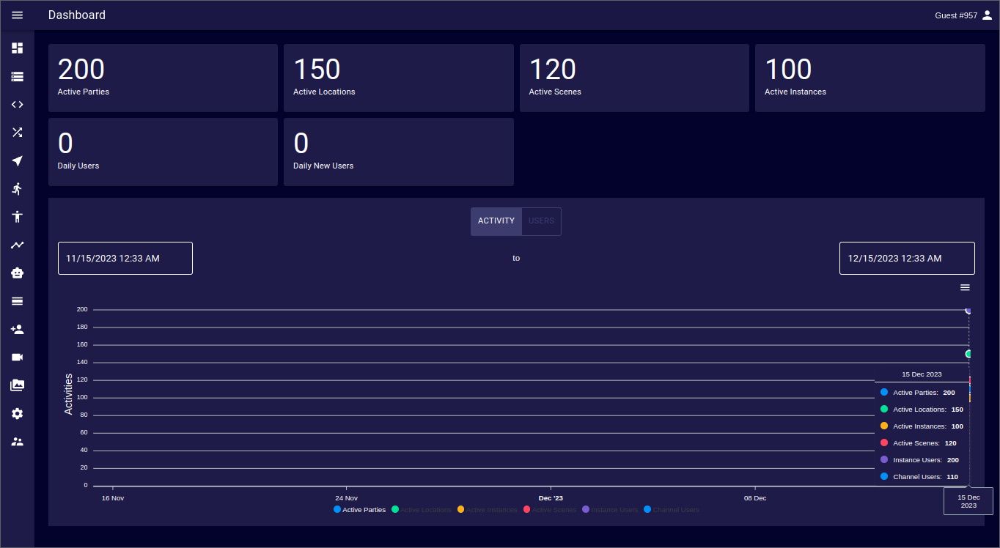

# Dashboard
The Admin Panel Dashboard provides an overview of several performance indicators relevant to an iR Engine's deployment.  
It gives a progress report for how a deployment is performing over a certain period of time based on data captured during the selected period.

## Usage Dashboard
The usage section shows a snapshot about the current usage of a deployment.

It shows the status of:
- Active Parties
- Active Locations
- Active Scenes
- Active Instances
- Daily Users
- Daily New Users

## Usage Time Series
This section shows a time series of the information in the snapshot over a customizable period of time  

The information is split between activity and user data.  
The time period is set to the last 30 days by default, but it can be changed to start and end at any arbitrary date.  
This information can be exported to an SVG or PNG image.  
