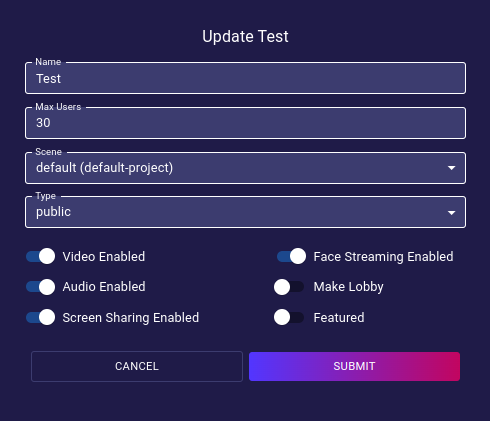
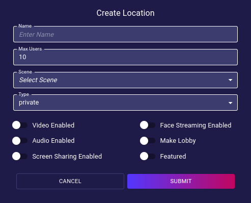

# Locations
The Locations page provides a tool to add new locations and list all existing locations of an iR Engine's deployment.

## Location Table
- **Name**:  
  The human-readable name of the location.
- **Scene**:  
  The scene file that will be used for the location.
- **Max Users Per Instance**:  
  The maximum number of users that are allowed in the location before a new instance of that location is created.
- **Type**:  
  The access type of the location _(public, private, showroom)_
- **Tags**:  
  The tags that the location is marked with.
- **Video Enabled**:  
  _(Yes/No)_ Whether the location has the Video feature enabled or not.
- **Action**:  
  - **View**: Opens a dialog to manage the properties of the location.
  - **Delete**: Orders the deployment to delete the location from the list _(no undoing possible)_.

### View/Edit Properties
The `Action: View` dialog provides a tool to edit all properties of the Location Table, plus:
- **Audio Enabled**:  
  Enable/disable the Audio feature for the location.
- **Screen Sharing Enabled**:  
  Enable/disable the Screen Sharing feature for the location.
- **Face Streaming Enabled**:  
  Enable/disable the Face Streaming feature for the location.
- **Make Lobby**:  
  Enable/disable the Lobby property for the location.
- **Featured**:  
  Enable/disable the Featured property for the location.

## Create Location
Pressing the `Add Location` button will open a dialog to create a new location in the deployment.  

  
_Note: Refer to the previous section ([Location Table](#location-table)) for a description of each of the properties._
