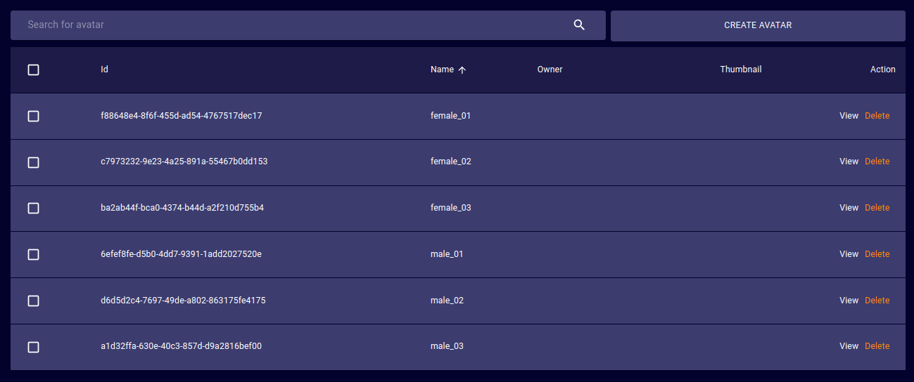
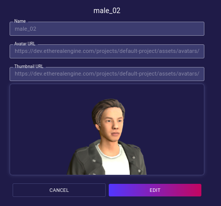
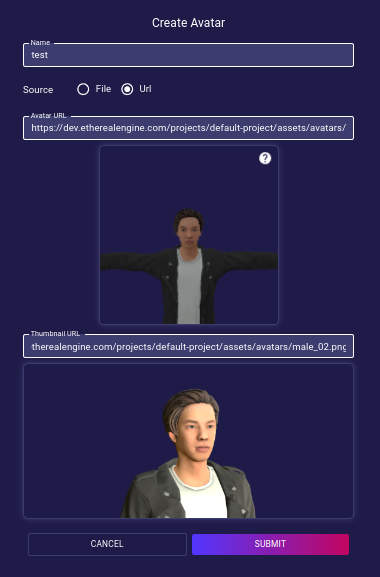

# Avatars
The Avatars page provides a tool to view, upload and manage all of the Avatar files stored in the iR Engine deployment.

## Avatar Table
- **Id**:  
  Unique ID of the selected Avatar.
- **Name**:  
  Human-readable name of the selected Avatar.
- **Owner**:  
  User that owns the given Avatar.
- **Public**:  
  Whether the selected Avatar is publicly accessible by users other than the owner.
- **Thumbnail**:  
  Uploaded or auto-generated thumbnail image of the Avatar.
- **Action**:  
  - **Delete**: Orders the deployment to delete the target Avatar _(no undoing possible)_.
  - **View**: Opens a dialog to manage the properties of the target Avatar.  
  Clicking the `Edit` button will make all Avatar properties editable until `Submit` is pressed.
  
## Create Avatar

