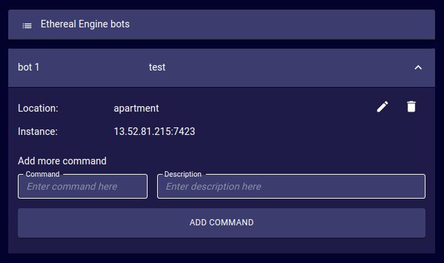

# Bots
<!-- TODO: Explain what this page is for -->
The Bots page provides a tool to view and manage the bots of an Ethereal Engine deployment.
## Create a new Bot
- **Name**:  .
- **Description**:  .
- **Location**:  .
- **Instance**:  .
- **Command**:  .
- **Description**:  .  

