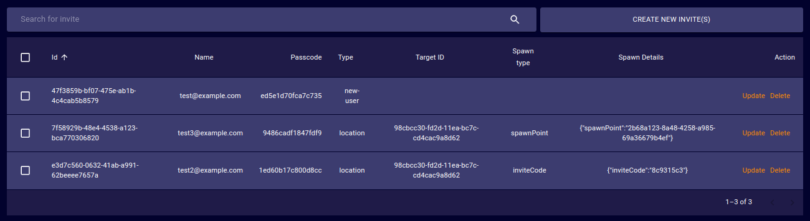
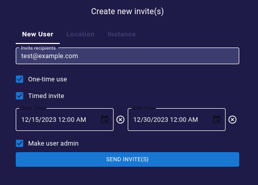
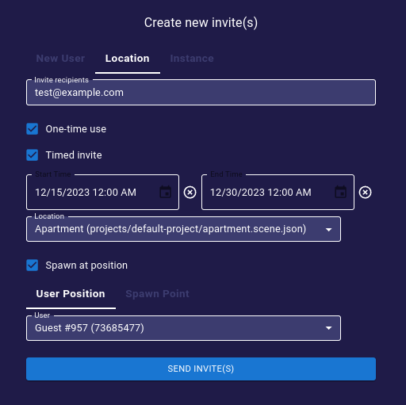

# Invites
The Invites page provides a tool to generate and manage invite links to the iR Engine deployment.
- **ID**: Unique ID of the Invite.
- **Name**: Human-readable name of the Invite.
- **Passcode**: .  <!-- TODO: What is this for? -->
- **Type**: _(new-user, friend)_.  <!-- TODO: Describe this field -->
- **Target ID**: .  <!-- TODO: Describe this field -->
- **Spawn Type**: .  <!-- TODO: Describe this field -->
- **Spawn Details**: .  <!-- TODO: Describe this field -->
- **Action**:  
  - **View**: Opens a dialog to edit the properties of the target Invite.  
  - **Delete**: Orders the deployment to delete the target Invite _(no undoing possible)_.

