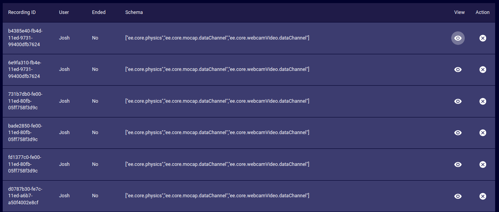
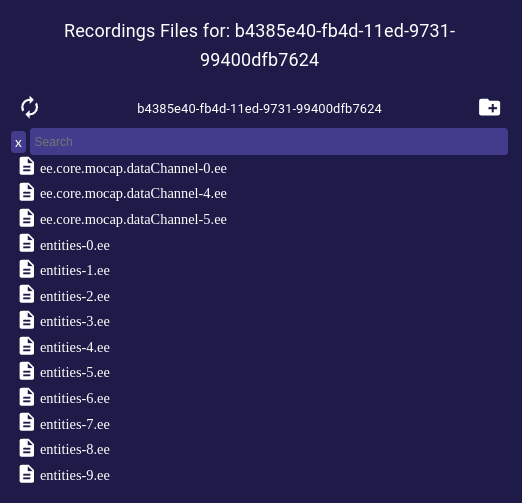

# Recordings
This page provides a tool to manage the Motion Capture (Mocap) recordings of the iR Engine deployment.

- **Recording ID**: Unique ID of the selected Recording.
- **User**: User that recorded the selected Recording.
- **Ended**: Represents the active state of recording. It will be true if you are finished recording, and false if you are actively recording.
- **Schema**: JSON object that contains the data of the selected Recording.
- **Action**:  
  - **Delete**: Orders the deployment to delete the target Recording _(no undoing possible)_.
  - **View**: Opens a dialog that provides a file explorer for managing the file-tree of the selected Recording.  
  
