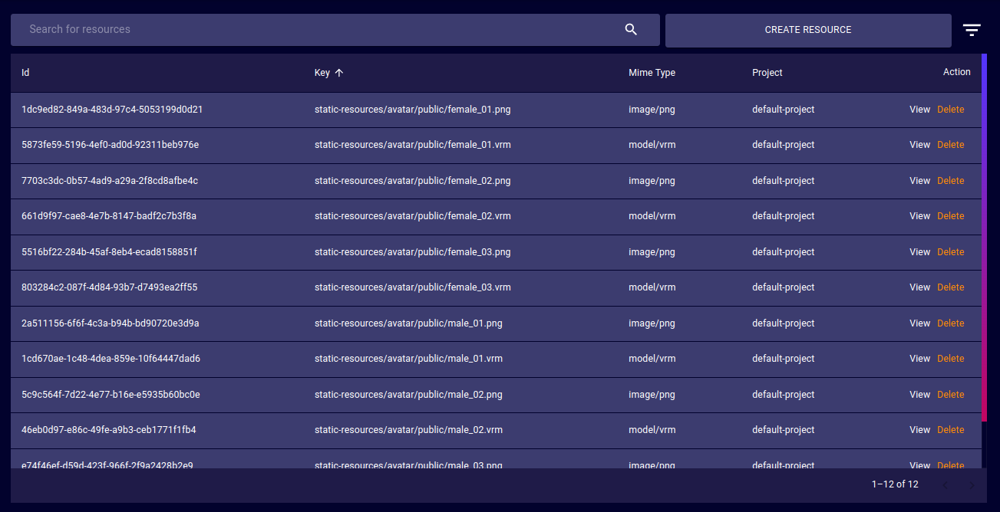
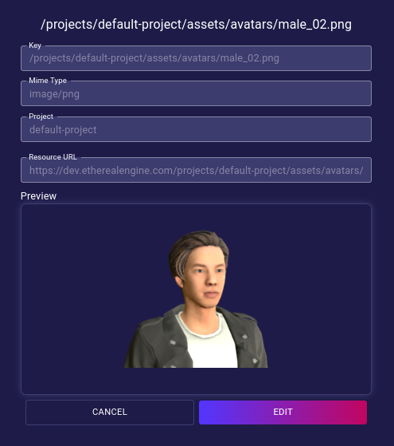
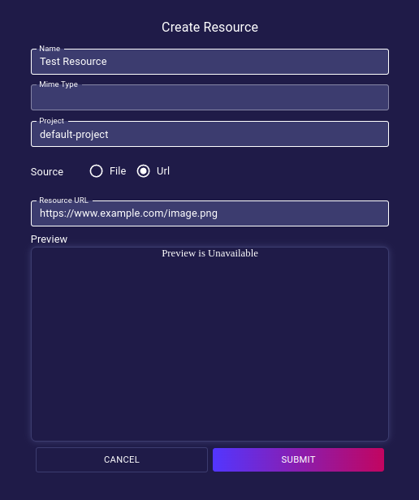

# Resources
The Resources page provides a tool to list and manage all of the Asset files of the iR Engine deployment.

- **Id**: Unique ID of the Asset/Resource file.
- **Key**: Path of the Asset/Resource file.
- **Mime Type**: Format/file-type of the Asset/Resource file.
- **Project**: Project that the Asset/Resource file belongs to.
- **Action**:  
  - **Delete**: Orders the deployment to delete the target Resource _(no undoing possible)_.
  - **View**: Opens a dialog that provides a tool to edit the properties of the target Resource.  
  

## Create Resource

