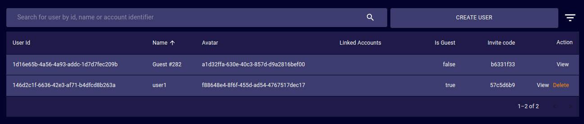
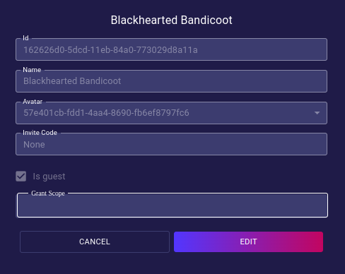
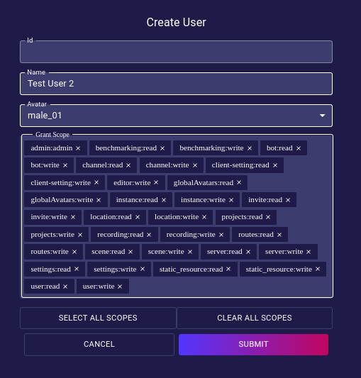
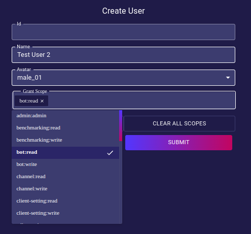

# Users

- **User ID**: Unique ID of the selected User.
- **Name**: Human-readable name of the selected User. Could contain a #NUMBER postfix to differentiate its name from other users with the same name. _(eg: Guest#234)_
- **Avatar**: Unique ID of the avatar that the selected User is currently using.
- **Linked Accounts**: Which external OAuth accounts the selected user has connected to their iR Engine deployment account.
- **Is Guest**: Whether the selected User is a Guest or Registered.
- **Invite Code**: Currently active invite code of the selected User.
- **Action**:  
  - **Delete**: Orders the deployment to delete the target User _(no undoing possible)_.
  - **View**: Opens a dialog that provides a tool to edit the properties of the target User.  
  

## Create User

<!-- TODO: Write an explanation for each of the permission scopes. -->
- **Admin: Admin**: Provides access for the Admin panel to the selected User.
- **Benchmarking: read/write**: .
- **Bot: read/write**: .
- **contentPacks: read/write**: .
- **Editor: write**: Provides access for the iR Engine Studio editor to the selected User.
- **globalAvatars: read/write**: .
- **Groups: read/write**: .
- **Instance: read/write**: .
- **Invite: read**: .
- **Location: read/write**: .
- **Party: read/write**: .
- **Projects: read/write**: .
- **realityPacks: read/write**: .
- **Recording: read/write**: .
- **Routes: read/write**: .
- **Scene: read/write**: .
- **Server: read/write**: .
- **Settings: read/write**: .
- **Static_resource: read/write**: .
- **User: read/write**: .
