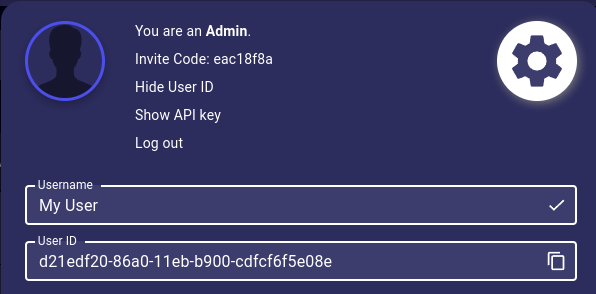

# Installation

Getting up and running requires just a few steps, but this can be tricky, 
depending on your platform and current environment. Please follow the directions 
for your environment.

## Pre-Install Checklist
- [ ] Ensure you have at least 16GB of RAM - you may run into issues running the full development setup with less
- [ ] Clone the repository to a location whose path __contains no spaces__.
- [ ] Install Node.js 16 or 18 (earlier versions not guaranteed to work)
- [ ] Install Python >=3.6 + [PIP](https://pypi.org/project/pip/), C++, and other build tools.
  See the [Mediasoup install instructions](https://mediasoup.org/documentation/v3/mediasoup/installation/) for full details.
- [ ] Install Docker
  _(Optionally)_ If you're NOT using docker, install MariaDB, Redis and MinIO manually and update repo's `.env.local` accordingly.

You should now be ready to follow the [Quick Start](#quick-start) instructions.

### Clone the repository
A lot has changed during development, and our monorepo has gotten quite large.
To avoid cloning the entire thing, use this command:
```
git clone https://github.com/etherealengine/etherealengine --depth 1
```

### Ensure you are running Node 16 or 18
The engine to date has only been confirmed to work perfectly with Node 16.x and 18.x. Earlier or later major versions 
are not guaranteed to work properly.

A version manager can be helpful for this:
 - NodeJS only: [NVM](https://github.com/nvm-sh/nvm)
 - Polyglot: [ASDF](https://github.com/asdf-vm/asdf)

Before running the engine, please check `node --version`
If you are using a node version below 16, please update or nothing will work. 
You will know you are having issues if you try to install at root and are 
getting dependency errors.

### Docker is your friend
You don't need to use [Docker](https://docs.docker.com/), but it will make your life much easier.  
If you don't wish to use Docker, you will need to setup mariadb and redis on your machine. You can find credentials in `/scripts/docker-compose.yml`

## Quick Start
If you are lucky, this will just work. However, you may encounter some issues. Make sure you are running Node 16, and check your dependencies.
```
cd path/to/etherealengine
cp .env.local.default .env.local
npm install
npm run dev-docker
npm run dev-reinit
npm run dev
```
Now run Ethereal Engine in browser by navigating to [this link](https://127.0.0.1:3000/location/default).   

### Accept Certificates
You'll have to tell your browser to ignore the insecure connections when you try to load the website.
 1. If it keeps displaying 'loading routes' progress for a long time, it is due to the fact that you have to allow certificates.
 2. Open Developer tools in your browser by clicking the side menu with three dots, then `More tools > Developer tools` (or use `Ctrl+Shift+I`) and then go to the 'Console' tab.
 3. You will see some errors in URL address starting with 'wss'. Replace 'wss' with 'https' and open it in new tab. Accept the certificate and reload your Ethereal Engine tab.
 4. You will see some errors in URL address starting with 'https://localhost:9000'. Open of the that URL and accept the certificate afterwards reload your Ethereal Engine tab.

### Admin System and User Setup
You can administrate many features from the admin panel at https://localhost:3000/admin

To make a user an admin, open a page and open the profile menu. There is a button labelled `Show User ID`
which opens a text field with your userId. Paste it in and run the following command in
your terminal:

`npm run make-user-admin -- --id={COPIED_USER_ID}`

Example:
`npm run make-user-admin -- --id=c06b0210-453e-11ec-afc3-c57a57eeb1ac`



#### Alternate Method:
Look up in User table and change userRole to 'admin' 
(It helps to use a graphical database explorer, we recommend [beekeeperstudio.io](https://beekeeperstudio.io/))

Test user Admin privileges by going to `/admin`


## Advanced Installation and Troubleshooting
If you run into any trouble with the Quick Start instructions:
- Please make sure you've followed the 
  [Mediasoup installation instructions](https://mediasoup.org/documentation/v3/mediasoup/installation/)
- Check your OS-specific instructions:
  - [Installing on Windows (10+)](3_windows.md)
  - [Installing on Mac OS X](2_mac_os_x.md)
- [Installation Troubleshooting](6_install_troubleshooting.md)
- [Advanced Setup](4_advanced_setup.md)
- [Vite dev server is stalling](https://vitejs.dev/guide/troubleshooting.html#dev-server)

