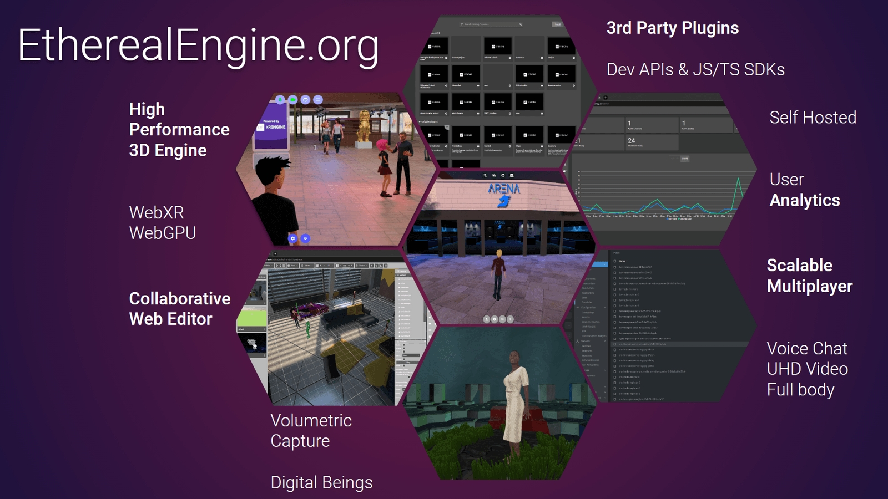
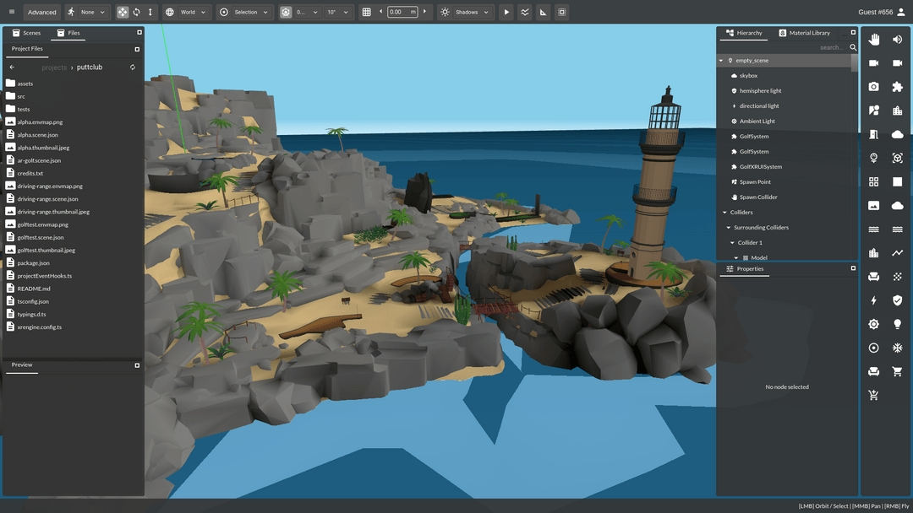
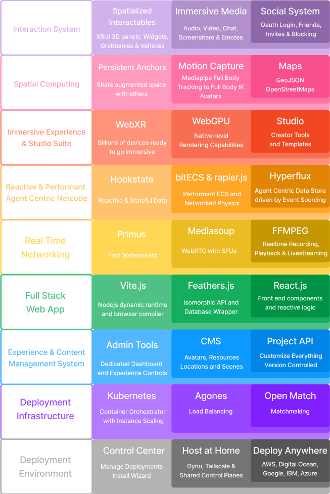

# Introduction
<!--
NOTE: This section is a fork in the road.
In this page, readers will decide on which path to take next.
They should be presented with a choice to become creator,developer,host,user.
This page should send them directly to the relevant `Become a ...` tutorial/guide.
-->
<!-- TODO: Model after:  -->
<!--       https://dev.epicgames.com/community/fortnite/getting-started/verse -->
<!--       https://dev.epicgames.com/community/fortnite/getting-started/creative -->
<!--       docs.blender.org/ -->

# Choose your Path
We've roughly divided up Ethereal stakeholders into four kinds of roles:

- **Users**:  
  You want to participate in an ethereal engine experience and share it with your peers.  

- **Creators**:  
  You're a creative designer curating experiences for other people, creating a venue, stage or story for others to enjoy.  
  The [Getting Started: Creator](/creator/gettingStarted/intro) guide is where you will want to start.

- **Developers**:  
  You're building tooling to empower creators to create powerful experiences. Here you have two choices:   
  - [Getting Started: No-Code Developer](/developer/visualscript/gettingStarted/intro) guide.
  - [Getting Started: Typescript Developer](/developer/visualscript/gettingStarted/intro) guide.

- **Hosts**:  
  You're focused on installing Ethereal Engine itself, maintaining it, possibly scaling and devops as well to deliver a smooth experience for the users.  
  The [Ethereal Engine Manual](/manual) is for you.

As the reader you can think of this as your branching off point. Utimately you may take on all the roles, but even if you just read everything straight through it's helpful to think about a given role from a given stakeholder perspective.


# Locations
_This Section will give an overview of what Ethereal Engine's **Locations** are._

# Features
_This Section will give an overview of Ethereal Engine's features_

# Frequently Asked Questions
_This file will contain an Introductory FAQ._  
_Each Manual has its own independent FAQ._

# Ethereal Engine

Ethereal Engine is a free, open, full-stack MMO engine that anyone can run for any reason - to host events, make games, showcase art, or just to provide a space for your community. There are plenty of platforms on which you can spend a bit to have a world, but you can't be in complete control of the experience or customise it from the ground up.

When the Ethereal Engine stack is deployed, that stack is sovereign, open and cross platform by default.
Users can create any kind of game or experience with no limits.
With the tech that's being built now, users will be able to seamlessly travel through portals from any worlds to any other world, on different servers,
and have all their data and identity travel with them.

This technology is for everyone, but especially people who want to build or belong to a community.



## WebXR Engine
The core engine is the heart of Ethereal Engine. Based around the WebXR spec, brought to life with libraries such as [threejs](https://threejs.org/), [bitecs](https://github.com/NateTheGreatt/bitECS), [rapier.js](https://github.com/dimforge/rapier.js), [Mediasoup WebRTC](https://github.com/versatica/mediasoup), [reactjs](https://reactjs.org/) & [hookstatejs](https://hookstate.js.org/).
With the latest understanding of Data-Oriented Design, ECS and Event-Sourcing paradigms, we have put together a robust MMO XR framework that rivals AAA capabilities, quality and speed.


## On The Web
Built for the web, Ethereal Engine providers a fully customisable and clean UI that works in both immersive and non-immersive contexts, as well as an administration panel for full control of deployment, locations, projects, avatars, custom routes & more.


## Deployment Stack
Running on the backend is a state of the art fullstack framework, template & deployment pipeline using [kubernetes](https://kubernetes.io/), [docker](https://www.docker.com/), [agones](https://agones.dev/site/), [openmatch](https://open-match.dev/site/) & [feathersjs](https://feathersjs.com/). The result is a fully customisable and scalable web app.


## Ethereal Studio
The Studio is fully integrated with the engine. It is a heavily modified version of [Mozilla Hubs' Spoke editor](https://hubs.mozilla.com/spoke), that has been deeply transformed to provide a fast and comprehensive Content Management System, File Browser, Cloud Edge Caching, Content Pipeline Tools and other creator tools for Ethereal Engine.



## Project API
The Project API is the core of what makes Ethereal Engine shine - the ability to load your own scenes, assets & code with a click of a button. Using github, we allow users to have fully version controlled access to extend the base functionality. You can see examples of the Project API in action [here](https://etherealengine.com/explore) and [here](https://github.com/EtherealEngine/ee-development-test-suite)
```ts
import type { ProjectConfigInterface } from '@etherealengine/projects/ProjectConfigInterface'

const config: ProjectConfigInterface = {
  onEvent: './projectEventHooks.ts',
  thumbnail: '/static/etherealengine_thumbnail.jpg',
  routes: {
    '/examples': {
      component: () => import('./examplesRoute')
    }
  }
}

export default config
```

## Stack Overview



